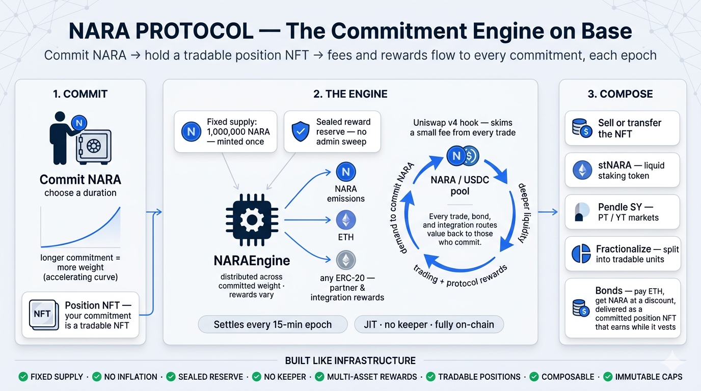
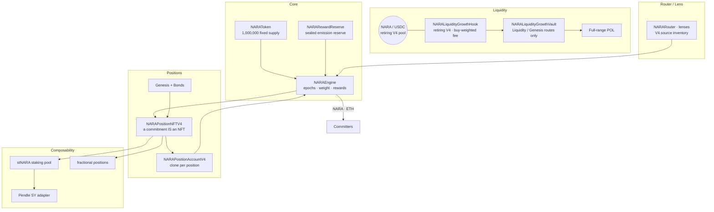

<div align="center">

# NARA — Fixed V4 Stack

**`contracts/v4/` is the only active contract source. The experimental V5 stack
has been deleted. Fresh deployment work is v4-only.**

[](https://soliditylang.org)
[](https://hardhat.org)
[](#-build--test)
[](#-security)
[](docs/UNISWAP_V4_HOOK.md)
[](LICENSE)
[](#-status)

<br/>



</div>

---

> **V4-only release rule (2026-08-05):** do not restore V5 source, tests,
> scripts, or deployment plans. Read [Current State](docs/CURRENT_STATE.md), the
> [v4 Hook specification](docs/UNISWAP_V4_HOOK.md), and the
> [v4 launch checklist](docs/V4_LAUNCH_CHECKLIST.md) before liquidity work.

---

## What is NARA?

The description below is the v4 protocol thesis and source inventory. It does
not claim that every optional v4 module is deployed.

NARA is built around commitment. You commit a fixed-supply token for a chosen duration; the longer you
commit, the more **weight** your position carries; and the protocol distributes its reward streams —
NARA emissions and contributed ETH across committed weight **every 15-minute epoch**. Rewards are
variable, never promised, and can be zero. The deployed engine's generic ERC-20 notification surface
is intentionally disabled; see [Current State](docs/CURRENT_STATE.md).

A commitment isn't a database row you can't move — **it's an NFT**. You can sell it, fractionalize it, wrap
it into a liquid staking token, or borrow against it, all without breaking the underlying commitment.

The v4 market uses a custom Uniswap v4 pool. Its vault is in `Liquidity` mode
and its generic ERC-20 Engine notifier path is disabled.

```
NARAToken -> NARAEngine -> positions / bonds
NARA/USDC pool -> v4 Hook -> v4 Vault -> balanced inventory -> Compounder/POL
```

> **New here?** Start with [`docs/CURRENT_STATE.md`](docs/CURRENT_STATE.md) and
> [`docs/UNISWAP_V4_HOOK.md`](docs/UNISWAP_V4_HOOK.md).

---

## Table of contents

- [Status](#-status)
- [V4 architecture snapshot](#-v4-architecture-snapshot--recoveryhistorical)
- [V4 source pillars](#-v4-source-pillars)
- [How the deployed V4 engine works](#-how-the-deployed-v4-engine-works--recoveryhistorical)
- [Uniswap v4 hook workstreams](#-the-uniswap-v4-hook-workstreams)
- [V4 positions, Genesis & bonds](#-v4-positions-genesis--bonds)
- [V4 composability source](#-v4-composability-source)
- [Contract map](#-contract-map)
- [Build & test](#-build--test)
- [Security](#-security)
- [Deployment](#-deployment)
- [Documentation](#-documentation)
- [License](#-license)

---

## 🚦 Status

**Fresh-v4 redeploy verification is in progress; product activation is
blocked.** Historical Base addresses are incident/recovery evidence, not a
manifest for the replacement. No transaction or deployment is authorized by
this repository state. Canonical evidence:
[`docs/CURRENT_STATE.md`](docs/CURRENT_STATE.md).

---

## 🏗 V4 Architecture Snapshot

This diagram describes the v4 source family; it is not an availability claim.
The v4 liquidity vault routes pool fees to POL; its `Engine` and `Split`
ERC-20 routes are disabled.



This is the v4 dependency shape. Full v4 layer inventory:
[`docs/NARA_V4_PROJECT_SCOPE.md`](docs/NARA_V4_PROJECT_SCOPE.md).

---

## 🧱 V4 Source Pillars

| Pillar | What it is |
|--------|-----------|
| **Token** | `NARAToken` — 1,000,000 fixed supply, minted once. ERC-2612 permit, ERC-1363 (`transferAndCall` to commit in one tx), capped ERC-3156 flash mint, multicall. |
| **Engine** | `NARAEngine` — the settlement core: JIT epoch advance and weight-based NARA/ETH accounting. Its generic ERC-20 rail exists in immutable code but is disabled for this deployment. |
| **Liquidity** | The retiring **Uniswap v4** pool and V4 hook/vault/compounder family. The deployed vault routes to POL; V4 ERC-20 Engine notification is prohibited. |
| **Positions** | `NARAPositionNFTV4` — a commitment *is* a tradable NFT, with Genesis tiers and a bond intake path. |
| **Composability** | Tested optional v4 source for `stNARA`, a Pendle SY adapter, and fractional position wrappers; not automatically deployed. |

---

## ⚙️ How the Deployed V4 Engine Works — Recovery/Historical

- **JIT epochs.** Time is divided into fixed (default 15-min) epochs. Epoch advancement is triggered
  *inside* user calls — no keeper cron. A single call bridges up to `MAX_JIT_ADVANCE = 8` epochs; past
  that, writes revert `EpochStale` until anyone calls `poke()` / `advanceEpochs()`. (Better failure
  shape than a cron dependency — but frontends must surface backlog.)
- **Weight = committed time.** `weight = amount × (1 + linearWad·r + quadraticWad·r²)`, where
  `r = duration / maxDuration`. Longer commitments receive a structurally higher weight (the curve
  accelerates with duration).
- **Adaptive emission.** Per-epoch NARA emission responds to commitment share, stress, a warmup factor
  (converges up to 1.0), and a decaying bootstrap weight — an incentive loop that rewards real commitment.
- **Two active reward rails.** NARA drip (emissions) and **ETH** through
  `notifyEthRewards()`. The deployed engine contains a role-gated ERC-20 reward
  function, but launch policy disables it because post-notification extensions
  can make later distributions under-allocate. Direct ETH transfers to the
  engine are rejected (`DirectEthTransferForbidden`).

Details: [`docs/EMISSION_MECHANICS.md`](docs/EMISSION_MECHANICS.md) · [`docs/LOCK_APY_REFERENCE.md`](docs/LOCK_APY_REFERENCE.md).

---

## 🦄 The Uniswap v4 Hook

### Fixed v4 design

The v4 hook is an asymmetric, per-block pressure design at permission suffix
`0x2088`. It uses configured `protocolDepth`, charges the input currency, and
aggregates all same-currency flow only within one block. Cross-block splitting
resets pressure by design and must not be described as prevented. Buy-only fees
produce USDC only and remain banked until matching NARA exists; only balanced
inventory can be compounded into active POL. `Engine` and `Split` vault routes
permanently revert, so pool ERC-20 fees do not enter the v4 Engine.

Source detail: [`docs/UNISWAP_V4_HOOK.md`](docs/UNISWAP_V4_HOOK.md).

---

## 🎟 V4 Positions, Genesis & Bonds

- **A commitment is an NFT.** `NARAPositionNFTV4` mints an ERC-721 backed 1:1 by a minimal-clone account
  (`NARAPositionAccountV4`) that owns the underlying engine position. Transfer the NFT = transfer the commitment.
- **Genesis positions** carry a reward multiplier (capped 5×) and an optional `isEternal` flag;
  Eternal positions exit only via `burnEternalGenesis()` (auto-harvest → release → return principal → burn).
- **Bonds** (`NARABondDepositoryV4NFT`) are historical V4 source for delivering
  a vesting position NFT. They were closed under the V4 launch plan and are not
  part of a fresh deployment unless explicitly selected. Historical criteria:
  [`docs/NARA_V4_BOND_OPENING_CRITERIA.md`](docs/NARA_V4_BOND_OPENING_CRITERIA.md).

Spec: [`docs/NARA_V4_NFT_POSITIONS.md`](docs/NARA_V4_NFT_POSITIONS.md).

---

## 🧩 V4 Composability Source

The following v4 components are built and tested but optional. They are not
automatically part of a fresh v4 release:

- **stNARA** (`NARAStakingPoolV4`) — liquid staking token over a pool of max-duration positions;
  exchange rate rises as rewards compound. First deposit mints dead shares (inflation-attack safe).
- **Pendle SY adapter** (`NARAStakingPoolSYV4`) — implements Pendle's SY (Standardized-Yield) interface
  over stNARA, with two reward streams (USDC + native ETH) and the NAV oracle Pendle needs.
- **Fractional positions** (`NARAFractionalPositionV4`) — split one committed position into up to 1e12
  units, tradable/collateralizable without breaking the engine commitment.

---

## 🗺 Contract map

`contracts/v4/` is the only active source path. Full v4 index with deploy steps:
[`docs/V4_CONTRACT_INDEX.md`](docs/V4_CONTRACT_INDEX.md).

| Layer | Contracts |
|-------|-----------|
| **Core** | `NARAToken` · `NARAEngine` · `NARARewardReserve` · `NARALauncher` · `NARALiquidityGrowthHook` · `NARALiquidityGrowthVault` · `utils/Create2HookDeployer` |
| **Positions** | `NARAPositionNFTV4` · `NARAPositionAccountV4` · `NARAPositionRendererV4` · `NARAGenesisRewardDistributorV4` · `NARABondVaultV4` · `NARABondDepositoryV4NFT` · `NARAOpsVaultV4` |
| **Router / Lens** | `router/NARARouter` · `router/NARADashboardLens` · `router/NARAPositionDataLensV1` · dormant `router/BribeRouterV4` reference |
| **Composability** | `composability/NARAStakingPoolV4` · `NARAStakingPoolSYV4` · `NARAFractionalPositionV4` · `NARAFractionalPositionFactoryV4` |

---

## 🔨 Build & test

Hardhat project. **Node 20 requires the polyfill** on every command.

```bash
npm install

# compile
NODE_OPTIONS="--require ./polyfill.cjs" npx hardhat compile

# full active suite; use CURRENT_STATE.md for the latest dated result
NODE_OPTIONS="--require ./polyfill.cjs" npx hardhat test

# compiled-runtime/creation size gate
NODE_OPTIONS="--require ./polyfill.cjs" npm run size

# static analysis
npm run slither:v4
```

Toolchain: `solc 0.8.34`, EVM `cancun`, `via-ir`. This repo is **Hardhat only** — the NARA basket
package is a separate Foundry repo. (`remappings.txt` / `echidna/` here are static-analysis artifacts,
not a Forge setup.)

---

## 🔐 Security verification

| Gate | Latest evidence |
|------|-----------------|
| V4 Hardhat suite | **526/526** passing on 2026-08-05 after the one-sided fee-bank regression was added |
| Focused Hook/Vault/Compounder/atomic batch | **43/43** passing on 2026-08-05 |
| V4 invariants | **4/4** Hardhat invariant regressions passing on 2026-08-05 |
| Static review | Slither completed every configured production v4 target; internal critic disposition is recorded in the dated audit run |
| Compiled size | Size gate passes; `NARAEngine` remains only 22 bytes below EIP-170 and must not grow |
| npm dependency audit | **0 high / 0 critical** on 2026-08-08 after overriding Mocha's `js-yaml` to fixed `4.3.1`; 8 low findings remain in Hardhat Verify's legacy Ethers v5 chain with no upstream fix |
| Echidna | **13/13** invariants on 2026-06-08, before the 2026-07-28 liquidity patch |
| Aderyn | Latest completed run is 2026-06-08; the 2026-07-29 rerun could not start because the binary is unavailable |

These are internal verification results, not an independent audit or a
production-readiness claim. Economic simulation, immutable production inputs,
fork/router/basket coverage, custody, actual rehearsal, soak, and integrations
remain open. See [`docs/CURRENT_STATE.md`](docs/CURRENT_STATE.md).

> Automated analysis is necessary but not sufficient. Independent review is a
> gate before any mainnet value or product activation. Disclosure policy:
> [`SECURITY.md`](SECURITY.md).

---

## 🚀 Deployment

Fresh v4 release order is: freeze the production configuration and immutable
source, finish protected integrations, pass deterministic/fork/invariant/
economic/static-analysis review, run the full atomic-launch preflight, and then
produce a verified deployment manifest. Every production transaction requires
explicit human approval. Nothing is available until verified addresses and
receipt-block evidence are recorded in
[`docs/CURRENT_STATE.md`](docs/CURRENT_STATE.md).

---

## 📚 Documentation

| Doc | Purpose |
|-----|---------|
| [CURRENT_STATE.md](docs/CURRENT_STATE.md) | Canonical live state (source of truth) |
| [NARA_V4_PROJECT_SCOPE.md](docs/NARA_V4_PROJECT_SCOPE.md) | V4 architecture and recovery-source inventory |
| [V4_CONTRACT_INDEX.md](docs/V4_CONTRACT_INDEX.md) | V4 source/deployment history |
| [UNISWAP_V4_HOOK.md](docs/UNISWAP_V4_HOOK.md) | Fixed v4 hook architecture (`0x2088`, pressure curves) |
| [EMISSION_MECHANICS.md](docs/EMISSION_MECHANICS.md) | Adaptive emission model |
| [NARA_V4_NFT_POSITIONS.md](docs/NARA_V4_NFT_POSITIONS.md) | Position NFT + account + Genesis spec |
| [ROUTER_LENS.md](docs/ROUTER_LENS.md) | Router · lens · disabled `BribeRouterV4` reference |
| [ROADMAP.md](docs/ROADMAP.md) | Product direction and phases |

Full index: [`docs/README.md`](docs/README.md).

---

## ⚠️ Disclaimer

This repository is software, not financial advice or an offer of any product. NARA is a permissionless,
non-custodial protocol with no admin over user principal. Tokens and positions can lose **all** value.
Rewards are variable and are **never promised or guaranteed** — they can be zero. Nothing here is
investment advice, and no NARA entity manages assets or promises any return. You are solely responsible
for evaluating the protocol and complying with the laws of your jurisdiction.
Historical v4 contracts exist on Base; no fresh-v4 manifest or public product is
available from this working tree.

---

## Community & contact

- 🌐 Website: **[naraprotocol.pro](https://naraprotocol.pro)**
- 🟣 Farcaster: **@naraprotocol**
- 𝕏 Twitter/X: **[@NARA_protocol](https://x.com/NARA_protocol)**
- 🔐 Security: **security@naraprotocol.pro** (see [SECURITY.md](SECURITY.md))

---

## License

[MIT](LICENSE) © NARA Protocol
