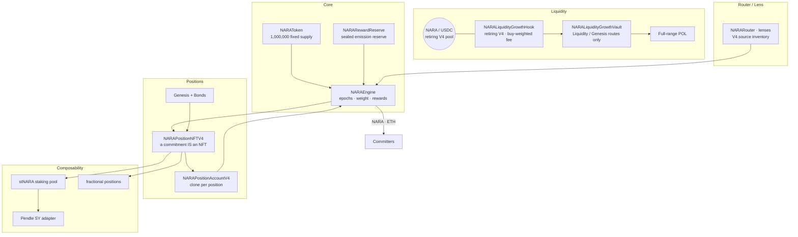

<div align="center">

# NARA Protocol — V4 Recovery / V5 Development

**The deployed V4 stack is recovery/retirement state. A separate complete V5
stack is under local development and is not deployed or production-approved.**

[](https://soliditylang.org)
[](https://hardhat.org)
[](#-build--test)
[](#-security)
[](docs/NARA_V5_HOOK_IMPLEMENTATION_REVIEW_2026-08-01.md)
[](LICENSE)
[](#-status)

<br/>


</div>

---

> **Complete V5 reset (2026-08-01):** The deployed v4 token, engine, reserve, and
> pool remain current only as recovery/retirement sources. V5 is a separate new
> token, engine, reserve, protocol-module, liquidity, custody, tooling, monitor,
> and integration stack. Stage 0 is executed; maturity moves no funds
> automatically. Read the
> [complete-stack V5 cold handoff](docs/NARA_V5_LIQUIDITY_RESET_COLD_HANDOFF.md)
> and [Hook V5 implementation review](docs/NARA_V5_HOOK_IMPLEMENTATION_REVIEW_2026-08-01.md)
> before relying on older status, fee, pool, or launch text in this README.

---

## What is NARA?

The description below is the deployed V4 protocol thesis and source inventory.
It is not a claim that V4 remains a launch candidate or that every V4 module is
deployed. V5 retains only decisions explicitly approved in the
[complete-stack plan](docs/NARA_V5_COMPLETE_STACK_REDEPLOY_PLAN.md).

NARA is built around commitment. You commit a fixed-supply token for a chosen duration; the longer you
commit, the more **weight** your position carries; and the protocol distributes its reward streams —
NARA emissions and contributed ETH across committed weight **every 15-minute epoch**. Rewards are
variable, never promised, and can be zero. The deployed engine's generic ERC-20 notification surface
is intentionally disabled; see [Current State](docs/CURRENT_STATE.md).

A commitment isn't a database row you can't move — **it's an NFT**. You can sell it, fractionalize it, wrap
it into a liquid staking token, or borrow against it, all without breaking the underlying commitment.

The retiring V4 market uses a custom Uniswap v4 pool. Its deployed vault is in
`Liquidity` mode and its generic ERC-20 Engine notifier path is disabled. The
local V5 candidate charges an intentionally aggressive fee on both legs and
accrues both currencies to its sealed Vault. Its fresh Vault, Engine,
named-POL/Controller, and Compounder paths exist only as tested local source. No
production V5 pool, manifest, or address exists.

```
deployed V4 recovery:  token / engine / reserve / retiring pool
local V5 candidate:    Hook -> Vault -> BootstrapLiquidity -> Compounder/POL
                                       -> Shared -> fresh Engine (X unapproved)
```

> **New here?** Start with [`docs/CURRENT_STATE.md`](docs/CURRENT_STATE.md), then
> the [V5 cold handoff](docs/NARA_V5_LIQUIDITY_RESET_COLD_HANDOFF.md) and
> [Hook V5 review](docs/NARA_V5_HOOK_IMPLEMENTATION_REVIEW_2026-08-01.md).

---

## Table of contents

- [Status](#-status)
- [V4 architecture snapshot](#-v4-architecture-snapshot--recoveryhistorical)
- [V4 source pillars](#-v4-source-pillars)
- [How the deployed V4 engine works](#-how-the-deployed-v4-engine-works--recoveryhistorical)
- [Uniswap v4 hook workstreams](#-the-uniswap-v4-hook-workstreams)
- [V4 positions, Genesis & bonds](#-v4-positions-genesis--bonds)
- [V4 composability source](#-v4-composability-source)
- [Contract map](#-contract-map)
- [Build & test](#-build--test)
- [Security](#-security)
- [Deployment](#-deployment)
- [Documentation](#-documentation)
- [License](#-license)

---

## 🚦 Status

**Deployed state: V4 recovery/retirement only. V5 is undeployed and product
activation is blocked.** The V4
token, engine, reserve, and July-30 pool exist on Base only as recovery and
retirement sources. The pool is initialized, liquid, and still tradeable until
the reviewed Safe withdrawal executes. Stage 0 is complete; its seven-day
`WindDown` moves nothing automatically. A complete selected V5 contract
candidate and offline deterministic deployment planner exist locally and are
tested, but they are undeployed, unapproved, unaudited, and not an immutable
release. Human-frozen economics/custody, protected integrations, independent
review, the actual one-hour deployment/retirement rehearsal, soak, and every V5
production address remain absent. Canonical evidence:
[`docs/CURRENT_STATE.md`](docs/CURRENT_STATE.md).

---

## 🏗 V4 Architecture Snapshot — Recovery/Historical

This diagram describes the V4 source family. It is not the V5 architecture or
an availability claim. The deployed V4 liquidity vault currently routes to POL;
its `Engine` and `Split` ERC-20 routes are disabled.



That was the V4 design order, not the current release instruction. Full V4
layer inventory: [`docs/NARA_V4_PROJECT_SCOPE.md`](docs/NARA_V4_PROJECT_SCOPE.md).
The complete V5 dependency and release order is intentionally separate.

---

## 🧱 V4 Source Pillars

| Pillar | What it is |
|--------|-----------|
| **Token** | `NARAToken` — 1,000,000 fixed supply, minted once. ERC-2612 permit, ERC-1363 (`transferAndCall` to commit in one tx), capped ERC-3156 flash mint, multicall. |
| **Engine** | `NARAEngine` — the settlement core: JIT epoch advance and weight-based NARA/ETH accounting. Its generic ERC-20 rail exists in immutable code but is disabled for this deployment. |
| **Liquidity** | The retiring **Uniswap v4** pool and V4 hook/vault/compounder family. The deployed vault routes to POL; V4 ERC-20 Engine notification is prohibited. |
| **Positions** | `NARAPositionNFTV4` — a commitment *is* a tradable NFT, with Genesis tiers and a bond intake path. |
| **Composability** | Tested V4 source for `stNARA`, a Pendle SY adapter, and fractional position wrappers; not deployed and not automatically selected for V5. |

---

## ⚙️ How the Deployed V4 Engine Works — Recovery/Historical

- **JIT epochs.** Time is divided into fixed (default 15-min) epochs. Epoch advancement is triggered
  *inside* user calls — no keeper cron. A single call bridges up to `MAX_JIT_ADVANCE = 8` epochs; past
  that, writes revert `EpochStale` until anyone calls `poke()` / `advanceEpochs()`. (Better failure
  shape than a cron dependency — but frontends must surface backlog.)
- **Weight = committed time.** `weight = amount × (1 + linearWad·r + quadraticWad·r²)`, where
  `r = duration / maxDuration`. Longer commitments receive a structurally higher weight (the curve
  accelerates with duration).
- **Adaptive emission.** Per-epoch NARA emission responds to commitment share, stress, a warmup factor
  (converges up to 1.0), and a decaying bootstrap weight — an incentive loop that rewards real commitment.
- **Two active reward rails.** NARA drip (emissions) and **ETH** through
  `notifyEthRewards()`. The deployed engine contains a role-gated ERC-20 reward
  function, but launch policy disables it because post-notification extensions
  can make later distributions under-allocate. Direct ETH transfers to the
  engine are rejected (`DirectEthTransferForbidden`).

Details: [`docs/EMISSION_MECHANICS.md`](docs/EMISSION_MECHANICS.md) · [`docs/LOCK_APY_REFERENCE.md`](docs/LOCK_APY_REFERENCE.md).

---

## 🦄 The Uniswap v4 Hook Workstreams

### Retiring deployed V4

The deployed V4 hook is the historical asymmetric, transaction-pressure design
at permission suffix `0x2088`. It uses configured `protocolDepth`, charges the
input currency, and was proven vulnerable to cheap cross-block order splitting.
Its July-30 pool remains tradeable only while recovery is prepared. The V4
vault is in `Liquidity` mode; `Engine` and `Split` permanently revert, so its
ERC-20 fees do not enter the deployed V4 Engine.

Historical source detail:
[`docs/UNISWAP_V4_HOOK.md`](docs/UNISWAP_V4_HOOK.md). The historical `300 USDC`
and `60,000 NARA` depth values are not V5 parameters.

### Local V5 candidate — tested, undeployed

- One canonical NARA/base PoolKey, exact opening price, exact-input/full-fill
  swaps, and a fixed phase curve of `15%`, `12.5%`, `10%`, `7.5%`, then `5%`
  on both gross input and actual AMM output.
- Bootstrap's two 15% legs are 30 nominal percentage points but a 27.75%
  sequential hook-only toll before the 0.30% LP fee and price impact.
- There is no V5 `protocolDepth` and no fixed-300-USDC fee basis. Phase changes
  depend on approved thresholds for named, active, recovery-locked POL.
- Both currencies accrue as PoolManager ERC-6909 claims to one bound Vault;
  `recordSwapFees` is synchronous and fail-closed.
- Routing belongs outside the Hook:
  `Unbound -> BootstrapLiquidity -> Shared -> Retired`. Bootstrap permanently
  classifies 100% of both currencies for liquidity. Shared may route an
  immutable, human-approved share `X` of post-transition fees to a fresh V5
  Engine, identically for both currencies. Entitlement is indexed at swap
  accrual; later claim redemption supplies exact backing and cannot let a new
  locker capture older fees. Stale Engine epochs route that share inactive
  without stopping swaps. `X` remains unapproved.
- A fresh Token, Reserve, Engine, position/modules/periphery, Vault, named-POL
  custody, no-swap Compounder, phase Controller, seed initializer, Uniswap V4
  position adapter, CREATE2 factory, and offline deployment planner exist as
  local source and tests. This is not a deployment or audit claim.
- V5 must not reuse the deployed V4 Engine's generic ERC-20 notifier or
  `syncEmissionReserve()` pattern.

Current local evidence and blockers:
[`docs/NARA_V5_HOOK_IMPLEMENTATION_REVIEW_2026-08-01.md`](docs/NARA_V5_HOOK_IMPLEMENTATION_REVIEW_2026-08-01.md).

---

## 🎟 V4 Positions, Genesis & Bonds

- **A commitment is an NFT.** `NARAPositionNFTV4` mints an ERC-721 backed 1:1 by a minimal-clone account
  (`NARAPositionAccountV4`) that owns the underlying engine position. Transfer the NFT = transfer the commitment.
- **Genesis positions** carry a reward multiplier (capped 5×) and an optional `isEternal` flag;
  Eternal positions exit only via `burnEternalGenesis()` (auto-harvest → release → return principal → burn).
- **Bonds** (`NARABondDepositoryV4NFT`) are historical V4 source for delivering
  a vesting position NFT. They were closed under the V4 launch plan and are not
  approved or automatically carried into V5. Historical criteria:
  [`docs/NARA_V4_BOND_OPENING_CRITERIA.md`](docs/NARA_V4_BOND_OPENING_CRITERIA.md).

Spec: [`docs/NARA_V4_NFT_POSITIONS.md`](docs/NARA_V4_NFT_POSITIONS.md).

---

## 🧩 V4 Composability Source

The following V4 components are built and tested but not deployed. They are
historical source candidates, not automatically part of the first V5 release:

- **stNARA** (`NARAStakingPoolV4`) — liquid staking token over a pool of max-duration positions;
  exchange rate rises as rewards compound. First deposit mints dead shares (inflation-attack safe).
- **Pendle SY adapter** (`NARAStakingPoolSYV4`) — implements Pendle's SY (Standardized-Yield) interface
  over stNARA, with two reward streams (USDC + native ETH) and the NAV oracle Pendle needs.
- **Fractional positions** (`NARAFractionalPositionV4`) — split one committed position into up to 1e12
  units, tradable/collateralizable without breaking the engine commitment.

---

## 🗺 Contract map

`contracts/v4/` is the deployed/recovery source path. `contracts/v5/` contains
the local undeployed complete-stack V5 contract candidate. Full V4 index with deploy steps:
[`docs/V4_CONTRACT_INDEX.md`](docs/V4_CONTRACT_INDEX.md).

| Layer | Contracts |
|-------|-----------|
| **Core** | `NARAToken` · `NARAEngine` · `NARARewardReserve` · `NARALauncher` · `NARALiquidityGrowthHook` · `NARALiquidityGrowthVault` · `utils/Create2HookDeployer` |
| **Positions** | `NARAPositionNFTV4` · `NARAPositionAccountV4` · `NARAPositionRendererV4` · `NARAGenesisRewardDistributorV4` · `NARABondVaultV4` · `NARABondDepositoryV4NFT` · `NARAOpsVaultV4` |
| **Router / Lens** | `router/NARARouter` · `router/NARADashboardLens` · `router/NARAPositionDataLensV1` · dormant `router/BribeRouterV4` reference |
| **Composability** | `composability/NARAStakingPoolV4` · `NARAStakingPoolSYV4` · `NARAFractionalPositionV4` · `NARAFractionalPositionFactoryV4` |

---

## 🔨 Build & test

Hardhat project. **Node 20 requires the polyfill** on every command.

```bash
npm install

# compile
NODE_OPTIONS="--require ./polyfill.cjs" npx hardhat compile

# full active suite; use CURRENT_STATE.md for the latest dated result
NODE_OPTIONS="--require ./polyfill.cjs" npx hardhat test

# focused local Hook V5 suites — 48 passing on 2026-08-01
NODE_OPTIONS="--require ./polyfill.cjs" npm run test:hook:v5

# complete selected V5 unit/integration/planner matrix — 83 passing
npm run test:v5

# compiled-runtime/creation size gate
NODE_OPTIONS="--require ./polyfill.cjs" npm run size

# static analysis
npm run slither:v4
```

Toolchain: `solc 0.8.34`, EVM `cancun`, `via-ir`. This repo is **Hardhat only** — the NARA Baskets
package is a separate Foundry repo. (`remappings.txt` / `echidna/` here are static-analysis artifacts,
not a Forge setup.)

---

## 🔐 Security verification

| Gate | Latest evidence |
|------|-----------------|
| Local V5 suites | Hook-focused **48/48** plus selected complete-stack unit/integration/planner **83/83** on 2026-08-01; no deployment occurred |
| Real Uniswap v4 path | Hook dual-leg buys/sells, stale-Engine routing, both token orderings, named-POL mint/increase, LP-fee harvest, claim redemption, and retirement are tested; the production router/basket matrix remains open |
| Protected swap planning | Unsigned V1 plan builder treats V4Quoter output as already Hook-adjusted net output and passes 8/8 tests; approved addresses, Universal Router calldata, and product integration remain open |
| Static review | Slither 0.11.5 analyzed all 25 production V5 targets with pinned solc 0.8.34; Hook returned 0 results and Medium/High triage found no actionable defect; independent external review remains a gate |
| Compiled size | Fresh plain-artifact gate passed on 2026-08-01; largest reviewed V5 runtime is Engine at 17,121 bytes, below 24,576; no deployment occurred |
| V4 recovery suite | Preserve the dated V4 and retirement-proof results in `CURRENT_STATE.md`; do not treat them as V5 readiness |
| npm dependency audit | **0 high / 0 critical** on 2026-07-28; 8 low findings remain in Hardhat Verify's legacy Ethers v5 chain with no upstream fix |
| Echidna | **13/13** invariants on 2026-06-08, before the 2026-07-28 liquidity patch |
| Aderyn | Latest completed run is 2026-06-08; the 2026-07-29 rerun could not start because the binary is unavailable |

These are internal verification results, not an independent audit or a
production-readiness claim. Economic simulation, immutable production inputs,
fork/router/basket coverage, custody, actual rehearsal, soak, and integrations
remain open. See [`docs/CURRENT_STATE.md`](docs/CURRENT_STATE.md).

> Automated analysis is necessary but not sufficient. Independent review is a
> gate before any V5 mainnet value or product activation. Disclosure policy:
> [`SECURITY.md`](SECURITY.md).

---

## 🚀 Deployment

The old V4 launch sequence is historical and must not be rerun for V5. Current
live actions are limited to the separately reviewed V4 recovery/retirement
process. No production V5 deployment script, payload, manifest, or address is
approved.

V5 release order is governed by the
[complete-stack plan](docs/NARA_V5_COMPLETE_STACK_REDEPLOY_PLAN.md): freeze the
production configuration and immutable source, finish protected integrations,
pass deterministic/fork/invariant/economic/static-analysis review, run and retire a disposable one-hour
complete-stack rehearsal, then create a separate production deployment with a
sealed recovery delay of at least seven days. Every production transaction
still requires explicit human approval. Nothing is deployed or available until
verified addresses and receipt-block evidence are recorded in
[`docs/CURRENT_STATE.md`](docs/CURRENT_STATE.md).

---

## 📚 Documentation

| Doc | Purpose |
|-----|---------|
| [CURRENT_STATE.md](docs/CURRENT_STATE.md) | Canonical live state (source of truth) |
| [NARA_V5_LIQUIDITY_RESET_COLD_HANDOFF.md](docs/NARA_V5_LIQUIDITY_RESET_COLD_HANDOFF.md) | Read-first recovery and V5 context |
| [NARA_V5_COMPLETE_STACK_REDEPLOY_PLAN.md](docs/NARA_V5_COMPLETE_STACK_REDEPLOY_PLAN.md) | Approved V5 direction and unresolved gates |
| [NARA_V5_HOOK_IMPLEMENTATION_REVIEW_2026-08-01.md](docs/NARA_V5_HOOK_IMPLEMENTATION_REVIEW_2026-08-01.md) | Local undeployed V5 Hook/stack evidence and blockers |
| [NARA_V4_PROJECT_SCOPE.md](docs/NARA_V4_PROJECT_SCOPE.md) | V4 architecture and recovery-source inventory |
| [V4_CONTRACT_INDEX.md](docs/V4_CONTRACT_INDEX.md) | V4 source/deployment history |
| [UNISWAP_V4_HOOK.md](docs/UNISWAP_V4_HOOK.md) | Retiring V4 hook architecture (`0x2088`, pressure curves) |
| [EMISSION_MECHANICS.md](docs/EMISSION_MECHANICS.md) | Adaptive emission model |
| [NARA_V4_NFT_POSITIONS.md](docs/NARA_V4_NFT_POSITIONS.md) | Position NFT + account + Genesis spec |
| [ROUTER_LENS.md](docs/ROUTER_LENS.md) | Router · lens · disabled `BribeRouterV4` reference |
| [ROADMAP.md](docs/ROADMAP.md) | Product direction and phases |

Full index: [`docs/README.md`](docs/README.md).

---

## ⚠️ Disclaimer

This repository is software, not financial advice or an offer of any product. NARA is a permissionless,
non-custodial protocol with no admin over user principal. Tokens and positions can lose **all** value.
Rewards are variable and are **never promised or guaranteed** — they can be zero. Nothing here is
investment advice, and no NARA entity manages assets or promises any return. You are solely responsible
for evaluating the protocol and complying with the laws of your jurisdiction.
V4 recovery contracts are deployed on Base; no V5 production contract is
deployed and no public product is available.

---

## Community & contact

- 🌐 Website: **[naraprotocol.pro](https://naraprotocol.pro)**
- 🟣 Farcaster: **@naraprotocol**
- 𝕏 Twitter/X: **[@NARA_protocol](https://x.com/NARA_protocol)**
- 🔐 Security: **security@naraprotocol.pro** (see [SECURITY.md](SECURITY.md))

---

## License

[MIT](LICENSE) © NARA Protocol
