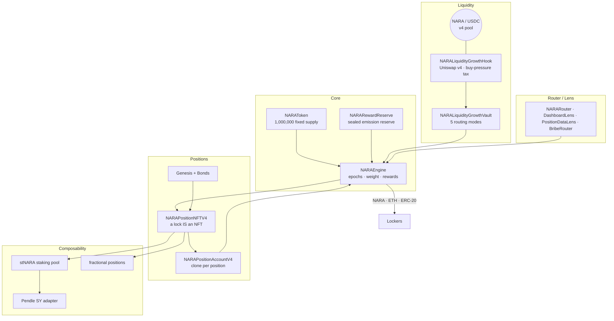

<div align="center">

# NARA Protocol v4

**A fixed-supply, time-preference yield engine on Base. Lock NARA, get a tradable NFT, earn multi-asset rewards — every epoch, forever.**

[](https://soliditylang.org)
[](https://hardhat.org)
[](#-build--test)
[](#-security)
[](docs/UNISWAP_V4_HOOK.md)
[](LICENSE)
[-orange)](#-status)

</div>

---

## What is NARA?

NARA rewards **patience**. You lock a fixed-supply token for a chosen duration; the longer you commit,
the more **weight** you carry; and weight earns a continuous stream of rewards — NARA emissions, ETH,
and any ERC-20 a partner chooses to distribute — settled **every 15-minute epoch**.

A lock isn't a database row you can't move — **it's an NFT**. You can sell it, fractionalize it, wrap
it into a liquid staking token, or borrow against it, all without breaking the underlying commitment.

And the value flywheel is built into the AMM itself: NARA's liquidity lives in a **custom Uniswap v4
pool** whose hook taxes swap pressure and routes that flow back to lockers.

```
        lock NARA (time)  ──▶  weight  ──▶  NARA + ETH + ERC-20 rewards each epoch
              ▲                                          │
              └──────── buy pressure + protocol fees ◀───┘  (Uniswap v4 hook → reward vault)
```

> **New here?** Read [`docs/NARA_V4_PROJECT_SCOPE.md`](docs/NARA_V4_PROJECT_SCOPE.md) — the cold-start
> map of the whole system.

---

## Table of contents

- [Status](#-status)
- [Architecture](#-architecture)
- [The five pillars](#-the-five-pillars)
- [How the engine works](#-how-the-engine-works)
- [The Uniswap v4 hook](#-the-uniswap-v4-hook)
- [Positions, Genesis & bonds](#-positions-genesis--bonds)
- [Composability layer](#-composability-layer)
- [Contract map](#-contract-map)
- [Build & test](#-build--test)
- [Security](#-security)
- [Deployment](#-deployment)
- [Documentation](#-documentation)
- [License](#-license)

---

## 🚦 Status

**Pre-launch. No v4 contracts are deployed to mainnet.** The code is complete and test-green; the gap
is deployment, not code. The retired v3 stack and the retired 2026-04-23 v4 incident stack are
**historical only** — never integrate against them. Canonical live state:
[`docs/CURRENT_STATE.md`](docs/CURRENT_STATE.md).

---

## 🏗 Architecture



Build order is bottom-up, reveal order is top-down: `token → engine → liquidity → positions → composability`.
Full layer model and per-contract status: [`docs/NARA_V4_PROJECT_SCOPE.md`](docs/NARA_V4_PROJECT_SCOPE.md).

---

## 🧱 The five pillars

| Pillar | What it is |
|--------|-----------|
| **Token** | `NARAToken` — 1,000,000 fixed supply, minted once. ERC-2612 permit, ERC-1363 (`transferAndCall` to lock in one tx), capped ERC-3156 flash mint, multicall. |
| **Engine** | `NARAEngine` — the settlement core: JIT epoch advance, weight-based reward accounting, NARA + ETH + ERC-20 rails. |
| **Liquidity** | A taxed **Uniswap v4** pool (`NARALiquidityGrowthHook` + `NARALiquidityGrowthVault`) that turns swap pressure into locker rewards. |
| **Positions** | `NARAPositionNFTV4` — a lock *is* a tradable NFT, with Genesis tiers and a bond intake path. |
| **Composability** | `stNARA`, a Pendle SY adapter, and fractional position wrappers built on top of the position layer. |

---

## ⚙️ How the engine works

- **JIT epochs.** Time is divided into fixed (default 15-min) epochs. Epoch advancement is triggered
  *inside* user calls — no keeper cron. A single call bridges up to `MAX_JIT_ADVANCE = 8` epochs; past
  that, writes revert `EpochStale` until anyone calls `poke()` / `advanceEpochs()`. (Better failure
  shape than a cron dependency — but frontends must surface backlog.)
- **Weight = committed time.** `weight = amount × (1 + linearWad·r + quadraticWad·r²)`, where
  `r = duration / maxLock`. Long locks earn a structural, quadratic advantage.
- **Adaptive emission.** Per-epoch NARA emission responds to lock share, stress, a warmup factor
  (converges up to 1.0), and a decaying bootstrap weight — an incentive loop that rewards real locking.
- **Three reward rails.** NARA drip (emissions), **ETH** via `notifyEthRewards()`, and arbitrary
  **ERC-20** via `notifyTokenRewards()` (role-gated — any protocol can bribe NARA lockers). Direct ETH
  transfers to the engine are rejected (`DirectEthTransferForbidden`).

Details: [`docs/EMISSION_MECHANICS.md`](docs/EMISSION_MECHANICS.md) · [`docs/LOCK_APY_REFERENCE.md`](docs/LOCK_APY_REFERENCE.md).

---

## 🦄 The Uniswap v4 hook

NARA's liquidity home is a **custom Uniswap v4 pool**. The hook is not a neutral fee — it is an
**asymmetric buy-pressure tax** that funds lockers, built the canonical v4 way.

- **Correct by construction.** `NARALiquidityGrowthHook is BaseHook`. `getHookPermissions()` declares
  `beforeInitialize + beforeSwap + beforeSwapReturnDelta`, which encode to a hook address ending in
  **`0x2088`** (`0x2000 | 0x80 | 0x08`) — mined via CREATE2 by `utils/Create2HookDeployer`. The
  declared permissions and the required address bits match exactly.
- **Asymmetric curves.** Buyers pay more under pressure than sellers (default buy 5→25%, sell 5→20%,
  across four pressure tiers). Buy pressure = `amountIn / depth`.
- **Anti-manipulation.** Depth uses `min(liveDepth, protocolDepth)` so a swapper can't inflate depth
  in-block to cheapen the fee, and **per-block cumulative-flow accounting** means splitting one large
  swap into many small ones charges the same total.
- **Fee skim, the v4 way.** The hook returns a `BeforeSwapDelta` and `poolManager.take()`s the fee in
  the input currency straight to the vault (best-effort accounting that never blocks a swap).
- **Vault routing (5 modes).** `NARALiquidityGrowthVault` routes collected fees: `Liquidity`
  (compound LP) · `Engine` (rewards) · `Split` · `Genesis` · `GenesisSplit`.

📄 Full expert deep-dive: **[`docs/UNISWAP_V4_HOOK.md`](docs/UNISWAP_V4_HOOK.md)**.

---

## 🎟 Positions, Genesis & bonds

- **A lock is an NFT.** `NARAPositionNFTV4` mints an ERC-721 backed 1:1 by a minimal-clone account
  (`NARAPositionAccountV4`) that owns the underlying engine position. Transfer the NFT = transfer the lock.
- **Genesis positions** carry a reward multiplier (capped 5×) and an optional `isEternal` flag;
  Eternal positions exit only via `burnEternalGenesis()` (auto-harvest → unlock → return principal → burn).
- **Bonds** (`NARABondDepositoryV4NFT`) sell discounted NARA for ETH, delivered as a **vesting position
  NFT** — bond buyers become engine participants from day one. Bonds stay **closed at launch**, opened
  deliberately per [`docs/NARA_V4_BOND_OPENING_CRITERIA.md`](docs/NARA_V4_BOND_OPENING_CRITERIA.md).

Spec: [`docs/NARA_V4_NFT_POSITIONS.md`](docs/NARA_V4_NFT_POSITIONS.md).

---

## 🧩 Composability layer

Built and tested, deployed after the core proves out (needs TVL + a market):

- **stNARA** (`NARAStakingPoolV4`) — liquid staking token over a pool of max-duration positions;
  exchange rate rises as rewards compound. First deposit mints dead shares (inflation-attack safe).
- **Pendle SY adapter** (`NARAStakingPoolSYV4`) — Standardized Yield over stNARA with **two** reward
  streams (USDC + native ETH). Exposes the NAV oracle Pendle needs.
- **Fractional positions** (`NARAFractionalPositionV4`) — split one locked position into up to 1e12
  units, tradable/collateralizable without breaking the engine lock.

---

## 🗺 Contract map

`contracts/v4/` — the only active source path. Full index with deploy steps: [`docs/V4_CONTRACT_INDEX.md`](docs/V4_CONTRACT_INDEX.md).

| Layer | Contracts |
|-------|-----------|
| **Core** | `NARAToken` · `NARAEngine` · `NARARewardReserve` · `NARALauncher` · `NARALiquidityGrowthHook` · `NARALiquidityGrowthVault` · `utils/Create2HookDeployer` |
| **Positions** | `NARAPositionNFTV4` · `NARAPositionAccountV4` · `NARAPositionRendererV4` · `NARAGenesisRewardDistributorV4` · `NARABondVaultV4` · `NARABondDepositoryV4NFT` · `NARAOpsVaultV4` |
| **Router / Lens** | `router/NARARouter` · `router/NARADashboardLens` · `router/NARAPositionDataLensV1` · `router/BribeRouterV4` |
| **Composability** | `composability/NARAStakingPoolV4` · `NARAStakingPoolSYV4` · `NARAFractionalPositionV4` · `NARAFractionalPositionFactoryV4` |

---

## 🔨 Build & test

Hardhat project. **Node 20 requires the polyfill** on every command.

```bash
npm install

# compile
NODE_OPTIONS="--require ./polyfill.cjs" npx hardhat compile

# full suite — 360 passing
NODE_OPTIONS="--require ./polyfill.cjs" npx hardhat test

# bytecode size gate
NODE_OPTIONS="--require ./polyfill.cjs" npm run size

# static analysis
npm run slither:v4
```

Toolchain: `solc 0.8.34`, EVM `cancun`, `via-ir`. This repo is **Hardhat only** — the NARA Baskets
package is a separate Foundry repo. (`remappings.txt` / `echidna/` here are static-analysis artifacts,
not a Forge setup.)

---

## 🔐 Security

NARA v4 is engineered like production infrastructure, not hackathon DeFi.

| Gate | Result (last verified 2026-06-08) |
|------|-----------------------------------|
| Hardhat test suite | **360 passing**, 0 failing, 0 skipped |
| Echidna invariants | **13/13 passing**, 10,004 calls (supply · NARA + ETH solvency · drip · weight · epoch/index monotonicity) |
| Slither | clean of new issues |
| Aderyn | 4 High / 18 Low — heuristic; Highs in bond/router/fractional, none in core (triaged) |
| Bytecode size | all deployable artifacts within EVM limits |

Design posture: sealed reward reserve & bond inventory (admin can't sweep), JIT liveness with explicit
`EpochStale` guards, role-gated reward notifiers, and immutable safety caps on owner setters. A
multi-lens internal audit (architecture / economics / UX) rated the system **~8.4–8.5/10** with **no
catastrophic design flaw** — the dominant risk is operational ("correct code, misoperated system"), not
contract logic.

> Automated analysis is necessary but not sufficient. An independent human / competitive review is
> planned before mainnet value. Disclosure policy: [`SECURITY.md`](SECURITY.md).

---

## 🚀 Deployment

Strict order (full runbook: [`docs/NARA_V4_LAUNCH_RUNBOOK.md`](docs/NARA_V4_LAUNCH_RUNBOOK.md), gates:
[`docs/V4_LAUNCH_CHECKLIST.md`](docs/V4_LAUNCH_CHECKLIST.md)):

1. `npm run deploy:v4:base:usdc` — core (token + engine + reserve + hook + vault), atomic via `NARALauncher`
2. `npm run verify:v4:preflight` — hook `0x2088` bits, pool/vault wiring
3. seed NARA/USDC liquidity → `npm run smoke:v4`
4. `npm run deploy:v4:allocations` — position NFT layer (bonds **closed**)
5. `npm run deploy:v4:router:lens` — router/lens/bribe
6. composability — only after core proves out
7. hand all roles to a Safe/timelock

Nothing is "done" until deployed addresses + verification are recorded in `CURRENT_STATE.md`.

---

## 📚 Documentation

| Doc | Purpose |
|-----|---------|
| [NARA_V4_PROJECT_SCOPE.md](docs/NARA_V4_PROJECT_SCOPE.md) | **Start here** — whole-project map, layers, status |
| [V4_CONTRACT_INDEX.md](docs/V4_CONTRACT_INDEX.md) | Every contract → purpose → deploy step |
| [CURRENT_STATE.md](docs/CURRENT_STATE.md) | Canonical live state (source of truth) |
| [UNISWAP_V4_HOOK.md](docs/UNISWAP_V4_HOOK.md) | Hook architecture deep-dive (`0x2088`, fee curves, anti-gaming) |
| [EMISSION_MECHANICS.md](docs/EMISSION_MECHANICS.md) | Adaptive emission model |
| [NARA_V4_NFT_POSITIONS.md](docs/NARA_V4_NFT_POSITIONS.md) | Position NFT + account + Genesis spec |
| [ROUTER_LENS.md](docs/ROUTER_LENS.md) | Router / lens / bribe layer |
| [NARA_V4_ECONOMIC_LAUNCH_ROADMAP.md](docs/NARA_V4_ECONOMIC_LAUNCH_ROADMAP.md) | Launch order + economics |

Full index: [`docs/README.md`](docs/README.md).

---

## License

[MIT](LICENSE) © NARA Protocol
