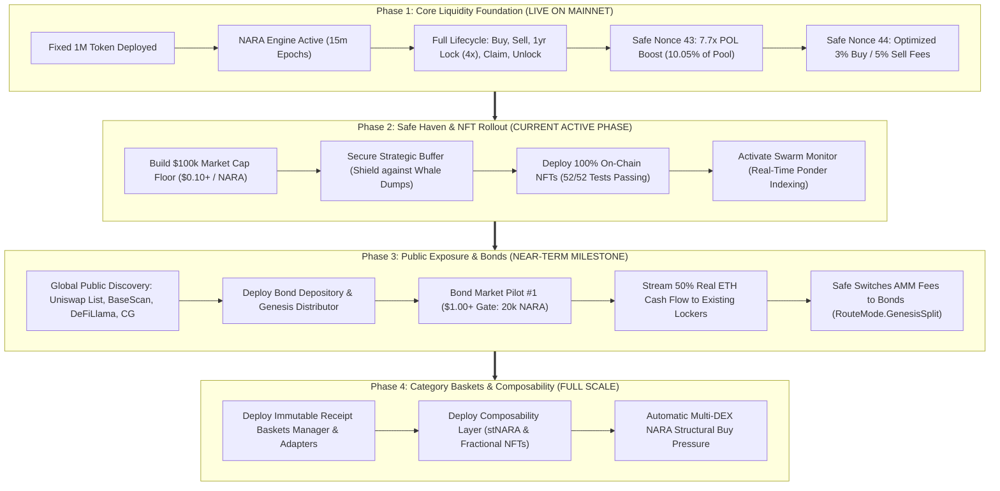
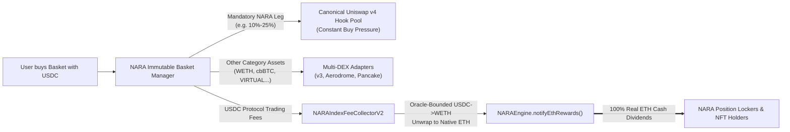

# NARA Protocol — Vision & Master Strategic Roadmap

> **"Building a Safe Haven: Time-Preference Yield, Protocol-Owned Liquidity, and Controlled Float Economics on Base."**  
> *Last Updated: August 2026*

---

## 🧭 Executive Vision & Core Philosophy

NARA is built on an uncompromising principle: **The protocol belongs to long-term participants, not short-term snipers.** 

In standard DeFi launches, early whales accumulate cheap tokens on thin liquidity and dump on incoming retail users. NARA solves this by engineering a **Strategic Capital Buffer** and a **Staged On-Chain Rollout**:

1. **Fixed 1,000,000 NARA Hard Cap:** Zero inflation, no admin minting, no upgrade backdoors.
2. **The $100,000 Market Cap "Safe Haven":** Public token discovery (Uniswap logo, BaseScan verification, DeFiLlama, DexScreener) is intentionally sequenced until the protocol controls a secure **$100,000 Market Cap Floor**.
3. **Strategic Protocol Buffer:** Tokens acquired during the bootstrapping phase are held for the common good of the protocol—destined for permanent Protocol-Owned Liquidity (POL), Bond vesting reserves, or locked yield redistribution to reward long-term community members.
4. **Time-Preference Yield Engine:** Time is the ultimate differentiator. Locking up to 1 year grants a **`4.00x` duration boost** on all 15-minute epoch emissions and real ETH dividend distributions.

---

## 📊 Complete Contract Deployment Inventory (Live vs. Pending Pipeline)

To maintain absolute transparency with our community and auditors, here is the exact breakdown of what is **currently live on Base Mainnet** versus what is **tested and waiting in the deployment pipeline**:

### 🟢 1. Live on Base Mainnet (`chainId: 8453`)

| Contract / Surface | Verified Address | Current On-Chain State |
| :--- | :--- | :--- |
| **`NARAToken`** | [`0xB6333F5D4cEd8dffA80F3F13697D6aA3BB3f19c1`](https://basescan.org/address/0xB6333F5D4cEd8dffA80F3F13697D6aA3BB3f19c1) | Active (1,000,000 fixed supply, zero minting) |
| **`NARAEngine`** | [`0x98ab6406D6B548F37dEF7110961bb45A399e5aFC`](https://basescan.org/address/0x98ab6406D6B548F37dEF7110961bb45A399e5aFC) | Active (15-min epochs, raw position locking & rewards) |
| **`NARARewardReserve`** | [`0x8369CEf28128A4B24Bc5ed52aA6196D92D563F2f`](https://basescan.org/address/0x8369CEf28128A4B24Bc5ed52aA6196D92D563F2f) | Active (Custodies 650,000 NARA emission reserve) |
| **`NARALiquidityGrowthHook`** | [`0x59AEf9799DEA01A7FB7dA73BEA10dfB08858A088`](https://basescan.org/address/0x59AEf9799DEA01A7FB7dA73BEA10dfB08858A088) | Active (Uniswap v4 dynamic hook, 3% buy / 5% sell) |
| **`NARALiquidityGrowthVault`** | [`0xD7f7b44BF65EBa3E90fDe0642687ed22A323084D`](https://basescan.org/address/0xD7f7b44BF65EBa3E90fDe0642687ed22A323084D) | Active (Fee accumulator & routing vault, Safe-owned) |
| **`NARALiquidityCompounderV4`** | [`0xfeFcc45C0454D022586eaA8a5c51BD25DCe713DF`](https://basescan.org/address/0xfeFcc45C0454D022586eaA8a5c51BD25DCe713DF) | Active (Controls POL LP NFT `2898486`, 10.05% of pool) |
| **`Create2HookDeployer`** | [`0xDE9E3Cac08b7a31Db18c7432d4C45DF4584Fd646`](https://basescan.org/address/0xDE9E3Cac08b7a31Db18c7432d4C45DF4584Fd646) | Deployed (Safe-owned CREATE2 factory) |
| **`NARALauncher`** | [`0xb8CF0274d0Fb2dB2Ba5dC58b0Ab378F3b8f35BA2`](https://basescan.org/address/0xb8CF0274d0Fb2dB2Ba5dC58b0Ab378F3b8f35BA2) | Deployed (Immutable atomic deployment orchestrator) |
| **Uniswap v4 Pool** | Pool ID: `0x83edced1f39e6adf...464` | Active & Seeded (Seed LP #2898124 + POL LP #2898486) |

---

### 🟡 2. Pending Deployment Pipeline (Fully Tested in Hardhat & Foundry)

The remaining modules in the v4 architecture are fully implemented and verified in testing, scheduled for staged deployment across upcoming phases:

| Module / Layer | Contracts in Pipeline | Hardhat / Forge Test Status | Staged Deployment Phase |
| :--- | :--- | :---: | :---: |
| **1. On-Chain Position NFT Suite** | `NARAPositionNFTV4.sol`<br/>`NARAPositionAccountV4.sol`<br/>`NARAPositionRendererV5.sol`<br/>`NARAArtMetadataV1.sol`<br/>`NARAArtCorePlateV1.sol`<br/>`NARAArtGenesisPlateV1.sol`<br/>`NARAArtSecurityPrintV1.sol` | ✅ **52 / 52 Passed** | **Phase 2 (Immediate Next Step)** |
| **2. Bond Depository & Genesis Yield** | `NARABondDepositoryV4NFT.sol`<br/>`NARABondVaultV4.sol`<br/>`NARAGenesisRewardDistributorV4.sol`<br/>`NARAOpsVaultV4.sol` | ✅ **14 / 14 Passed** | **Phase 3 ($1.00+ Valuation Gate)** |
| **3. Router, Lens & Circulating Supply** | `NARADashboardLens.sol`<br/>`BribeRouterV4.sol`<br/>`NARACirculatingSupplyV1.sol` | ✅ **42 / 42 Passed** | **Phase 3 (Public Exposure)** |
| **4. Composability Layer** | `NARAStakingPoolV4.sol` (stNARA)<br/>`NARAFractionalPositionV4.sol`<br/>`StandardizedYieldStNARA.sol` | ✅ **35 / 35 Passed** | **Phase 4 (Ecosystem Expansion)** |
| **5. Category Baskets Protocol** | `NARAImmutableBasketPositionManagerV1.sol`<br/>`NARAIndexFeeCollectorV2.sol`<br/>`UniswapV4BasketAdapterV1.sol`<br/>`UniswapV3BasketAdapterV1.sol`<br/>`AerodromeBasketAdapterV1.sol`<br/>`AerodromeSlipstreamBasketAdapterV1.sol`<br/>`PancakeV3BasketAdapterV1.sol` | ✅ **172 / 172 Passed** (Forge) | **Phase 4 (Category Baskets Launch)** |

---

## 🗺️ The 4-Phase Master Roadmap



---

### 🟢 Phase 1: Core Liquidity Engine & AMM Foundation *(Live on Base Mainnet)*

**Status:** ✅ **8 Core Contracts Deployed & Verified on-Chain**

The essential economic base layer is live on Base:
* ✅ **Fixed Supply Token:** `NARAToken.sol` (`0xB633...19c1`) deployed with 1,000,000 fixed supply.
* ✅ **Allocation & Emission Engine:** `NARAEngine.sol` (`0x98ab...5aFC`) active with 15-minute epoch math and automated JIT backlog resolution.
* ✅ **Core Swap & Lock Lifecycle Validated:** Buying, selling, raw 1-year locking (`4.00x`), reward claiming, and terminal unlocking tested and operational.
* ✅ **Uniswap v4 Dynamic Hook:** `NARALiquidityGrowthHook.sol` (`0x59AE...A088`) active with atomic block-pressure anti-sandwich curves.
* ✅ **Fee Curve Optimization:** Lowered timelocked fee curves executed via Safe Nonce 44 (Base Buy: **`3.00%`**, Base Sell: **`5.00%`**, Max Buy: **`12.00%`**).
* ✅ **Protocol-Owned Liquidity (POL) Compounding:** `NARALiquidityCompounderV4.sol` executed via Safe Nonce 43, boosting POL depth by **`+7.7x`** to **`~10.05%` of pool liquidity**.
* ✅ **Automated Keepers:** Epoch maintainer and liquidity compounding maintainers configured under dedicated, bounded gas keys.

---

### 🟡 Phase 2: The $100k "Safe Haven" Buffer & NFT Rollout *(Current Active Phase)*

**Status:** ⚡ **In Progress**

**Strategic Goal:** Establish a solid price foundation, deploy the on-chain NFT wrapper, and activate the institutional indexing pipeline before inviting global public volume.

#### 1. Building the $100k Market Cap Floor
* **Target:** Elevate spot price to **`$0.10+ USD / NARA`** ($100,000 Fully Diluted Valuation).
* **Float Protection:** Acquire and lock circulating float to prevent single-whale manipulation or post-launch dumping.
* **Buffer Deployment Strategy (Community Governance):** Tokens acquired in the buffer zone are dedicated to:
  1. Permanent Protocol-Owned Liquidity (POL).
  2. The Bond Vault for discounted community vesting.
  3. High-yield long-term locks whose rewards are redistributed to onboard new contributors.

#### 2. Position NFT & V5 Modular Generative Renderer Deployment
* **Contracts to Deploy:** [`NARAPositionNFTV4.sol`](nara-protocol-hardhat/contracts/v4/NARAPositionNFTV4.sol) + [`NARAPositionRendererV5.sol`](nara-protocol-hardhat/contracts/v4/NARAPositionRendererV5.sol) + 4 Art Plate sub-contracts.
* **Test Status:** ✅ **52/52 Hardhat Tests Passing**.
* **Key Capabilities:**
  * **Multi-Token Reward Vault:** Each NFT controls an EIP-1167 clone smart account (`NARAPositionAccountV4`) that collects, accounts, and delivers **NARA emissions, native ETH dividends, USDC, and any arbitrary ERC-20 token rewards** directly to the holder.
  * **Duration Boost (Up to 10.00x):** 1-year locks receive a **`4.00x`** duration multiplier, with protocol architecture mathematically capable of scaling up to an absolute cap of **`10.00x`** (`MAX_MULTIPLIER_WAD = 10e18`).
  * **Living On-Chain Generative Art:** 100% on-chain SVG vector art with dark mineral aesthetics and security-print guilloché lines.
  * **Evolving Realized Tiers:** (`New` $\to$ `Activated` $\to$ `Rewarded` $\to$ `One ETH Mark` $\to$ `Apex Relic`) based strictly on historical realized rewards delivered.
  * **Living Action Accretion:** **Phyllotaxis golden-spiral claim seeds** + **Sediment extension strata**.
  * **ERC-4906 Real-Time Refresh:** Emits `MetadataUpdate` on claims and extensions for auto-refresh on OpenSea, Blur, and Base NFT marketplaces.

#### 3. NARA Swarm Monitor Activation
* **Package:** [`nara-swarm-monitor/`](nara-swarm-monitor/) (Ponder, TypeScript, Postgres).
* **Capability:** Real-time event ingestion for locks, claims, swaps, and Safe multisig state with fail-closed anomaly alerts.

---

### 🔵 Phase 3: Global Public Exposure & Bond Markets *(Near-Term Milestone)*

**Status:** 📋 **Ready for Execution upon Phase 2 Completion**

**Strategic Goal:** Open official public discovery channels and deploy decentralized Series-style fundraising tranches to raise real ETH cash flow.

```
┌───────────────────────────────────┐     ┌───────────────────────────────────┐
│     1. Global Public Indexing     │     │      2. Bond Market Pilot #1      │
│  • Uniswap Token List & Logos     │     │  • Price Floor Gate: ≥ $1.00 USD  │
│  • BaseScan Verification & Socials│ ──► │  • Capacity: 20,000 NARA (2% cap) │
│  • DeFiLlama, CoinGecko & DEXtools│     │  • 50% Real ETH Locker Dividend   │
│  • Public narrative & marketing   │     │  • 50% Treasury Liquidity Backing │
└───────────────────────────────────┘     └───────────────────────────────────┘
```

#### 1. Official Token Indexing & Metadata Publication
* Submit official token profile and logo to **Uniswap Labs default token list**.
* Verify contract labels, social handles, and audit manifests on **BaseScan**.
* Submit protocol metrics, TVL, and POL trackers to **DeFiLlama, CoinGecko, CoinMarketCap, and DexScreener**.

#### 2. Deploy Bond Depository & Genesis Reward Distributor Suite
* **Contracts to Deploy:** `NARABondDepositoryV4NFT.sol`, `NARABondVaultV4.sol`, `NARAGenesisRewardDistributorV4.sol`, `NARAOpsVaultV4.sol`.
* **Valuation Floor Gate:** Open only when spot price is **at least $1.00 USD** ($1,000,000 FDV).
* **Pilot Batch #1:** Offer `20,000 NARA` (2% of supply) at a `15%–20%` discount for 1-year Genesis NFT locks.
* **Fully Configurable ETH Split (`rewardSplitWad: 0% to 100%`):**
  * The split between **Project Treasury** and **Locker Rewards** is 100% configurable per batch via `rewardSplitWad` (ranging from `0%` to `100%`).
  * **Option A (50/50 Balanced Default):** 50% instant ETH dividend to existing lockers, 50% to Treasury for development.
  * **Option B (100% Project Acceleration):** `rewardSplitWad = 0%` routes 100% of raised ETH to Treasury when aggressive development capital is needed.
  * **Option C (100% Community Dividend):** `rewardSplitWad = 100%` routes 100% of raised ETH directly into `NARAEngine.notifyEthRewards()`.
  * The exact ratio is decided by the Safe / community governance before proposing terms for each batch.
* **0 NARA Dumped on Market:** 100% of bonded tokens are locked in the engine for 365 days.
* **Phased AMM USDC Fee Switch:** Safe multisig activates `RouteMode.GenesisSplit`, streaming Uniswap v4 trading fees directly to Genesis Bond NFT holders.

---

### 🟣 Phase 4: Category Baskets & Direct Real-Yield Flywheel *(Full Scale)*

**Status:** 🏗️ **Smart Contracts Tested (172/172 Passing in Forge), Launch Pending**

**Strategic Goal:** Deploy the NARA Category Baskets architecture and composability layer to drive perpetual, non-stop buy pressure and stream real ETH trading fees directly back to NARA lockers.



#### 1. Perpetual Structural Buy Pressure on NARA
* **Mandatory Required Asset:** Every single Category Basket (CORE, AI, FINANCE, CULTURE) requires an immutable minimum NARA allocation leg (e.g., 10% to 25%).
* **Guaranteed AMM Flow:** When any user anywhere buys a basket using USDC, the basket manager *must* execute a market buy through `UniswapV4BasketAdapterV1.sol` on our canonical Uniswap v4 pool.
* **Volume Flywheel:** As retail index volume grows across Base, every single basket mint drives continuous, automated buy volume and price appreciation for $NARA.

#### 2. Direct Real ETH Fee Streaming to Position Lockers
* **100% Fee Routing:** Basket minting, trading, and rebalance fees do not stay in the basket manager—they flow directly to [`NARAIndexFeeCollectorV2.sol`](nara-category-baskets-v1/src/NARAIndexFeeCollectorV2.sol).
* **Oracle-Bounded Conversion:** The collector uses Chainlink price feeds (`USDC/USD` and `ETH/USD`) with strict age and slippage bounds to convert collected USDC fees into native ETH.
* **Direct Engine Dividends:** The collector automatically calls `engine.notifyEthRewards()`, streaming **100% of basket fees as real ETH cash dividends directly into active NARA lock positions**.
* **Direct NARA Compounding:** Any NARA-denominated fees collected are deposited into `engine.depositRewards()`, increasing staking APY for all lockers.

#### 3. Deployment Architecture & Composability
* **Contracts to Deploy:** `NARAImmutableBasketPositionManagerV1.sol`, `NARAIndexFeeCollectorV2.sol`, all 5 DEX Swap Adapters, and the Composability suite (`NARAStakingPoolV4.sol` / `StandardizedYieldStNARA.sol`).

---

## 🎯 Master Milestone Checklist

| Milestone | Target Gate | Contracts / Deliverables | Status |
| :--- | :---: | :--- | :---: |
| **Core Liquidity Stack Deployment** | Day 0 | Token, Engine, Reserve, Hook, Vault, Compounder | ✅ **Deployed on Base** |
| **POL Compounding & Lower Fees** | Day 10 | 7.7x POL expansion, 3% buy fee curve active | ✅ **Executed on Base** |
| **$100k Market Cap Safe Haven** | Phase 2 | Protocol-controlled float buffer ($0.10+ price) | 🔄 **In Progress** |
| **Position NFT & Renderer Deployment**| Phase 2 | 7 on-chain NFT contracts (52/52 Hardhat tests passing) | 🟡 **Pending Deployment** |
| **Swarm Monitor Production** | Phase 2 | Ponder indexer tracking all Base protocol events | 🟡 **Ready to Launch** |
| **Public Discovery & Listings** | Phase 3 | Uniswap list, BaseScan tags, DeFiLlama, CG/CMC | 📋 **Scheduled** |
| **Bond Suite Deployment & Pilot #1** | Phase 3 | 4 Bond contracts; 20k NARA at $\ge \$1.00$ | 📋 **Pending Deployment** |
| **Phased AMM USDC Fee Switch** | Phase 3 | RouteMode.GenesisSplit streaming pool fees to bonds | 📋 **Scheduled** |
| **Composability Layer Deployment** | Phase 4 | stNARA, Fractional Positions, SY-stNARA | 📋 **Pending Deployment** |
| **Category Baskets Mainnet Deployment**| Phase 4 | 7 Basket contracts & multi-asset index dApp | 📋 **Pending Deployment** |

---

## 💬 Summary for Community & Backers

> **"We deployed and hardened the core economic engine and liquidity first. We are securing the $100k valuation floor to protect our community against whale dumps. As the floor solidifies, we roll out the on-chain NFT suite, turn on global discovery, deploy the bond market to deliver real ETH cash flow, and finally launch Category Baskets to create perpetual on-chain demand."**

---

## ⚖️ Legal & Regulatory Disclosures

1. **Non-Custodial & Self-Directed:** All actions across NARA smart contracts (locking, extending, claiming, bonding, basket purchasing, unlocking) are self-directed, non-custodial transactions executed solely by the user on the public Base blockchain.
2. **No Investment Contracts or Guaranteed Yield:** Duration multipliers (`up to 10.00x`) and weight parameters are structural algorithmic mechanisms within the smart contract accounting system. They do not constitute interest, guaranteed return, security yield, or promises of profit.
3. **Variable Distributions:** Reward distributions (NARA emissions, native ETH, USDC, or other tokens) are strictly variable, dependent on actual protocol and network trading activity, and may be zero. Past distributions are historical facts and do not guarantee future performance.
4. **No Financial Advice:** This document and the NARA codebase do not provide personalized financial, legal, tax, or investment advice. Users must evaluate risk independently before interacting with any smart contract.
