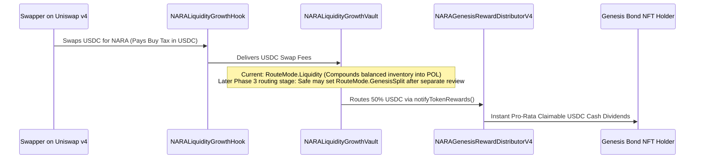

# NARA Protocol — Master Knowledge Base & Deep Architecture Reference

> **Authoritative Knowledge Base for FIELD Token / NARA Protocol Workspace**  
> **Status:** Fixed v4 Production Stack Only (`contracts/v4/`).  
> **Target Network:** Base Mainnet (`chainId: 8453`).  
> **Scope:** Smart Contracts, Economic Formulas, Uniswap v4 Hook/Vault/Compounder, NFT Generative Art Engine, Category Baskets, Swarm Indexer, UI/UX Design Systems, Keepers, Multisig Custody & Governance.
> **Last full evidence reconciliation:** 2026-08-21 at Base block `50274054`.
> **Latest monitoring supplement:** 2026-08-28 through Base block `50552058`.
> The supplement updates Swarm and epoch-maintenance evidence only; it does not
> revalidate every protocol, basket, frontend, or custody fact in this document.

---

## Table of Contents

1. [Executive Summary & Monorepo Topology](#1-executive-summary--monorepo-topology)
2. [Token Supply & Macroeconomics](#2-token-supply--macroeconomics)
3. [NARA Engine & Adaptive Mathematical Models](#3-nara-engine--adaptive-mathematical-models)
4. [Uniswap v4 Dynamic Fee Hook & Fee Vault](#4-uniswap-v4-dynamic-fee-hook--fee-vault)
5. [Liquidity Compounder & POL Flywheel](#5-liquidity-compounder--pol-flywheel)
   - [5.1 Treasury Range Manager Candidate](#51-treasury-range-manager-candidate)
6. [Position NFTs & Generative On-Chain Art Engine](#6-position-nfts--generative-on-chain-art-engine)
7. [Bond Markets & Genesis Reward Distribution](#7-bond-markets--genesis-reward-distribution)
8. [Composability Layer (stNARA, SY-stNARA, Fractional Positions)](#8-composability-layer-stnara-sy-stnara-fractional-positions)
9. [NARA Category Baskets (Foundry Architecture & Adapters)](#9-nara-category-baskets-foundry-architecture--adapters)
10. [Swarm Monitor & Real-Time Indexer (Ponder)](#10-swarm-monitor--real-time-indexer-ponder)
11. [Frontend Ecosystem & Design Systems](#11-frontend-ecosystem--design-systems)
12. [Operations, Keepers & Multisig Governance](#12-operations-keepers--multisig-governance)
13. [Cross-Repository Release Protocol & State Gates](#13-cross-repository-release-protocol--state-gates)
14. [Codex Solidity Audit Pipeline](#14-codex-solidity-audit-pipeline)
15. [Master Deployment Registry & Verified Addresses](#15-master-deployment-registry--verified-addresses)
16. [Evidence Reconciliation, Incident Memory & Open Repair Register](#16-evidence-reconciliation-incident-memory--open-repair-register)

---

## 1. Executive Summary & Monorepo Topology

NARA is a **fixed-supply, time-preference yield and protocol-owned liquidity (POL) engine** native to Base. 
The system operates exclusively on the **fixed v4 production stack**. All experimental v5 versions and legacy v3 contracts are retired and frozen.

> 🧭 **Strategic Vision & Roadmap:** For the full phased deployment sequence ($100k Safe Haven floor, on-chain NFTs, public token discovery, and bond tranches), see [`docs/NARA_V4_MASTER_ROADMAP.md`](NARA_V4_MASTER_ROADMAP.md).

### Workspace Architecture
The workspace contains self-contained sub-projects without a shared root `package.json`:

```
c:\Users\linas\Desktop\FIELD Token/
├── nara-protocol-hardhat/             # Canonical v4 Hardhat project: contracts, deploy scripts, tests, runbooks
│   ├── contracts/v4/                  # Sole active Solidity source tree (0.8.34)
│   ├── test/                          # Comprehensive Hardhat TypeScript test suite
│   ├── scripts/                       # Deployment, verification, atomic Safe batch builders
│   ├── deployments/                   # Verified JSON deployment receipts & manifests
│   └── docs/                          # Canonical engineering and operational documentation
├── nara-category-baskets-v1/          # Canonical Category Baskets Foundry project
│   ├── src/                           # Basket Manager, Fee Collectors, Adapters
│   ├── test/                          # Forge test suite (130+ unit & fork tests)
│   └── app/                           # Publishable Baskets web app (React, Vite, Cloudflare Pages/Workers)
├── nara-swarm-monitor/                # Canonical Indexer & Alerting (Ponder, TypeScript)
│   ├── ponder.config.ts               # Multi-contract event source bindings
│   └── ponder.schema.ts               # Relational onchain analytics database schema
├── naraswap/                          # Dedicated NARA v4 Uniswap v4 swap frontend
├── nara_protocol_public/              # Public-facing documentation & verification packages
├── apps/                              # Auxiliary / Historical frontends
│   ├── nara-lockboard/                # Deferred 100-slot light-theme Degen Board
│   ├── nara-arena/                    # Historical v3 Arena game (retired)
│   ├── nara-lotto/                    # Historical v3 Lotto game (retired)
│   ├── nara-analytics/                # Read-only Recharts analytics dashboard
│   ├── nara-protocol-ui/              # naraprotocol.io landing page
│   └── nara-simple-ui/                # Simple lock/mine UI
├── templates/wallet-game-app/         # Pinned wagmi/RainbowKit game starter
├── .codex/audit/                      # 6-Specialist multi-agent smart contract audit pipeline
└── docs/                              # Workspace-wide cross-repo release protocols & UX standards
```

---

## 2. Token Supply, Macroeconomics & Governance Knobs

### Fixed Supply Architecture (`NARAToken.sol`)
- **Total Supply:** `1,000,000 NARA` (`1e24` wei). Minted exactly once to Treasury in the constructor.
- **Zero Inflation / No Admin Mint:** Zero minting functions, zero burning functions in the token contract.
- **No Backdoors / Pauses:** No owner, no blacklist, no upgrade proxy, no transfer taxes at the ERC-20 token layer.
- **Standard Extensions:**
  - **ERC-2612 Permit:** Gasless approvals via EIP-712 signatures.
  - **ERC-1363 Transfer and Call:** `transferAndCall` & `transferFromAndCall` enabling atomic single-tx token lock actions.
  - **ERC-3156 Flash Mint:** `MAX_FLASH_LOAN = 100,000 NARA` (`10%` of total supply), `FLASH_FEE_BPS = 10` (0.10%). Flash loan fees route to immutable `FLASH_FEE_SINK` (`NARAEngine`).

### Supply Distribution & Custody Accounting

| Allocation Bucket | NARA Amount | % of Supply | On-Chain Custody Contract | Market Status |
| :--- | :---: | :---: | :--- | :--- |
| **Reward Reserve** | `650,000 NARA` | 65.0% | `NARARewardReserve` (`0x8369...3F2f`) | **Excluded** (Sealed emission custody) |
| **Bond Depository Reserve** | `200,000 NARA` | 20.0% | `NARABondVaultV4` | **Excluded** (Unsold bond inventory) |
| **Team / Strategic Vesting** | `40,000 NARA` | 4.0% | External Vesting Safe / Timelock | **Excluded** (Non-market locked float) |
| **Initial Public Float** | **`110,000 NARA`** | **11.0%** | Uniswap v4 Pool + Initial Holders | **Real Public Circulating Supply** |
| **Total Fixed Supply** | **`1,000,000 NARA`** | **100.0%** | `NARAToken` (`0xB633...19c1`) | **Immutable Hard Ceiling** |

### Circulating Supply Oracle (`NARACirculatingSupplyV1.sol`)
Public listing portals (CoinGecko, CoinMarketCap, DexScreener) compute market capitalization from the public circulating supply, not FDV. `NARACirculatingSupplyV1` computes:

$$\text{Circulating Supply} = \text{Total Capped Supply} - \sum \text{balanceOf}(\text{Excluded Accounts})$$

* **Excluded Accounts:** `NARARewardReserve`, `NARABondVaultV4`, Team Vesting, and Burn Sink (`0x000000000000000000000000000000000000dEaD`).
* **Why User Locks Remain Circulating for Public Metrics:** Under CoinGecko standards, tokens locked voluntarily in `NARAEngine` still belong to users (like veCRV or staked ETH) and count towards market cap.
* **Internal Liquid Free-Float:** The Swarm Monitor additionally tracks the **Real Liquid Float** (`Public Circulating - Total Locked in Engine - POL`), revealing the true sellable market float (often `< 30,000 NARA`).

### Open-Market Buybacks & Reserve Top-Up Sinks
Anyone (community, treasury, or sponsors) can purchase NARA on the open market (Uniswap v4) and route tokens into protocol custody:
1. **Topping Up `NARARewardReserve` (`0x8369...3F2f`):**
   - Transferred tokens are permanently locked because `NaraSweepForbidden()` forbids admin extraction.
   - `balanceOf(RewardReserve)` increases, which **instantly reduces the circulating supply on-chain** via `NARACirculatingSupplyV1`.
2. **Topping Up `NARABondVaultV4`:**
   - Increases `bondInventory()`.
   - Excluded from circulating supply and can be allocated to future **Discounted Bond Sales** to acquire permanent Protocol-Owned Liquidity (POL).
3. **Direct Yield Top-Up (`NARAEngine.notifyRewards()`):**
   - Injects market-bought NARA directly into active epoch rewards, instantly boosting the APR of long-term conviction lockers.

### Protocol Governance Knobs & Timelocks

| Contract / Surface | Governance Knob / Parameter | Default Production Value | Operational Limit / Timelock | Authority / Setter |
| :--- | :--- | :---: | :---: | :--- |
| **`NARALiquidityGrowthHook`** | Fee Curve Update (`setFeeCurve` / `executeFeeCurve`) | Active base fees: 3% Buy / 5% Sell | Bytecode max 20.00% (`2000 BPS`); active buy cap 12.00%; **7-Day Timelock** | Production Admin Safe |
| **`NARABondVaultV4`** | Bond Release Cap (`proposeReleaseCap`) | 0 NARA active | Max `290,000 NARA` / **7-Day Timelock** | `CAP_ADMIN_ROLE` (Safe) |
| **`NARABondVaultV4`** | Authorized Market (`proposeMarket`) | Unset | Contract check / **7-Day Timelock** | `MARKET_ADMIN_ROLE` (Safe) |
| **`NARAPositionNFTV4`** | Secondary Royalties (`setDefaultRoyalty` / `freezeRoyalties`) | **Deployed & Active on Base (`0x01D3AC0acda01FE5D6788fA0B4062de94C8DE52b`)** | Approved Phase-2 policy: exactly 10.00% (`1000 BPS`) to the manifest-pinned production Treasury address, 0 BPS claim fees | Production Admin Safe (`0xd65c...`) / Immutable after freeze |

| **`NARAEngine`** | Epoch Duration (`EPOCH_LENGTH`) | 900 seconds (15 min) | Immutable | Fixed in code |
| **`NARAEngine`** | Max Lock Duration (`MAX_MAX_LOCK_EPOCHS`) | 35,040 epochs (1 Year) | Max lock duration = 1 Year | Configurable within bounds |
| **`NARAEngineModelLib`** | Global Maximum Multiplier (`MAX_MULTIPLIER_WAD`) | **10.00X (`10e18`)** | Immutable Smart Contract Hard Cap | Fixed in library code |
| **`NARAPositionRendererV8`** | Continuous Quadratic Multiplier (`calculateMultiplierWad`) | $1.01\text{X} \to 3.00\text{X}$ | Formula: $m(r) = 1.0 + r + r^2$ ($r = \text{duration}/35040$) | Immutable Renderer bytecode |
| **`NARAFleetDeckLensV1`** | 6-Card Fleet Deck Synergy (`_evaluateSynergy`) | $+0\%$ to $+25\%$ (0 to 2500 BPS) | Max 6 slots / Strict Duplicate Token ID Rejection | Immutable Periphery View |
| **`NARALiquidityCompounderV4`** | Compounding Bounty (`setKeeperBountyBps`) | 200 BPS (2.00%) | Max 1000 BPS (10.00%) | Production Admin Safe |

---

## 3. NARA Engine & Adaptive Mathematical Models

The `NARAEngine` (`contracts/v4/NARAEngine.sol`) is the heart of the time-preference mechanism and the primary reward-accounting sink for explicitly Engine-routed value. It manages epochs, locking duration multipliers, emission calculations, stress feedback, and multi-asset reward accounting. It is not the destination for every revenue surface; manifest-approved Treasury routes, including Position NFT royalties, remain separate.

### 3.0 Protocol Value Capture and Explicit Revenue Routes
Revenue routing is contract- and policy-specific; it must be read from the active manifest, contract state, and executed governance evidence rather than inferred from a universal slogan. Engine reward routes reward active position lockers, while Treasury routes remain under Treasury control. In particular, the approved Position NFT policy sends ERC-2981 secondary-sale royalties to the manifest-pinned production Treasury address at 10.00% and freezes that receiver/rate; those royalties do **not** automatically reach lockers. The following surfaces have their own explicit routes:

1. **Decentralized Bonds (`NARABondDepositoryV4NFT.sol`):** `50%` of all ETH paid by bond purchasers is immediately pushed into `engine.notifyEthRewards()`.
2. **Category Baskets (`NARAIndexFeeCollectorV2.sol`):** `100%` of basket trading and minting fees are converted via Chainlink oracles into native ETH and pushed into `engine.notifyEthRewards()`, while NARA fees are sent to `engine.depositRewards()`.
3. **Uniswap v4 AMM Fees (`NARALiquidityGrowthVault.sol`):** RouteMode options stream trading fees into POL depth compounding or directly to Genesis Bond lockers (`RouteMode.GenesisSplit`).
4. **Third-Party Bribes (`BribeRouterV4.sol`):** External protocols seeking NARA governance or liquidity alignment route bribe tokens and ETH directly to `NARAEngine`.
5. **Future Ecosystem Applications (Games, Launchpads, Vaults):** Any new product built in the workspace is bound by protocol rules to route protocol revenue into `engine.notifyEthRewards()`.

```
[Bond ETH 50%] ──┐
[Basket Fees]  ──┼──► NARAEngine.notifyEthRewards() ──► 100% Real ETH Cash Dividends to Lockers
[Future dApps] ──┤
[Bribes]       ──┘
```

### 3.1 Epoch Lifecycle & JIT Advance
- **Epoch Duration:** `EPOCH_LENGTH = 900` seconds (15 minutes). 96 epochs per day.
- **Clock Formula:**
  $$\text{currentEpoch} = \left\lfloor \frac{\text{block.timestamp} - \text{GENESIS\_TIMESTAMP}}{\text{EPOCH\_LENGTH}} \right\rfloor$$
- **Just-In-Time (JIT) Auto-Advance:** User-facing calls automatically advance up to `MAX_JIT_ADVANCE = 8` un-settled epochs in-line. If backlog exceeds 8 epochs, operations revert with `EpochStale`, prompting keeper or permissionless `advanceEpochs(maxSteps)` catchup.

### 3.2 Lock Mechanics & Duration Multipliers
Users deposit NARA for $D$ epochs ($\text{minLockEpochs} \le D \le \text{maxLockEpochs}$, where $\text{maxLockEpochs} = 35,040 \approx 1\text{ year}$).
- **Activation:** Locks activate at `currentEpoch + activationDelayEpochs + 1` (default delay: 8 epochs).
- **Maturity:** Positions unlock after `unlockEpoch = currentEpoch + durationEpochs + 1`.
- **Weight Formula (`NARAEngineModelLib.computeWeight`):**
  $$r = \frac{\text{durationEpochs}}{\text{maxLockEpochs}} \in [0, 1]$$
  $$m = 1 + \frac{\text{durationLinearWad} \times r}{10^{18}} + \frac{\text{durationQuadraticWad} \times r^2}{10^{18}}$$
  $$\text{Weight} = \text{NetAmount} \times m$$
- **Weight Multiplier Ladder (Production Configuration: Linear 0.5, Quadratic 2.5):**
  - Min Duration (1 epoch): $\approx 1.01\times$
  - 90 Days (8,760 epochs): $\approx 1.28\times$
  - 180 Days (17,520 epochs): $\approx 1.88\times$
  - 270 Days (26,280 epochs): $\approx 2.78\times$
  - 365 Days (35,040 epochs): $\approx \mathbf{4.00\times}$ (Max Multiplier cap enforced $\le 10\times$).
- **Concurrent Active Slots & Recycling (`MAX_LOCK_POSITIONS_PER_ACCOUNT = 64`):**
  - Accounts can hold up to 64 active positions concurrently.
  - Slots are **not a lifetime cap**: calling `unlock(positionId)` decrements `_ownerPositionCount`, immediately freeing and recycling the slot for new locks over multi-year compounding cycles.

### 3.3 Adaptive Emission Model Formulas
Executed on every epoch transition (`NARAEngineModelLib.computeNextEpochSnapshot`):

1. **Warmup Factor:**
   $$\text{warmup}_{n+1} = \text{warmup}_n + \frac{\text{warmupRateWad} \times (1 - \text{warmup}_n)}{10^{18}}$$
2. **Bootstrap Weight (Phantom Dilution):**
   $$\text{bootstrap}_{n+1} = \frac{\text{bootstrap}_n \times \text{bootstrapDecayWad}}{10^{18}}$$
3. **Weighted Lock Share (WLS):**
   $$\text{WLS} = \frac{\text{ActiveWeight}}{\text{CirculatingSupply} + \text{ActiveWeight} + \text{BootstrapWeight}}$$
4. **Base Emission Dynamics:**
   $$\text{BaseEmission}_{n+1} = \text{clamp}\left(\frac{\text{BaseEmission}_n \times \text{growthFactorWad}}{10^{18}}, \text{minBaseEmission}, \text{maxBaseEmission}\right)$$
5. **Incentive vs Penalty & Stress Feedback:**
   $$\text{Incentive} = 1 + \frac{a_{\text{wad}} \times \text{WLS}}{10^{18}}$$
   $$\text{Penalty} = \frac{b_{\text{wad}} \times \text{Stress}_n}{10^{18}}$$
   $$\text{EmissionFactor} = \max(\text{Incentive} - \text{Penalty}, 0)$$
   $$\text{Emission} = \text{clamp}\left(\frac{\text{BaseEmission} \times \text{EmissionFactor}}{10^{18}}, 0, \text{maxBaseEmission}\right)$$
6. **Beta & Horizon Contraction:**
   $$\beta = \beta_0 + \frac{m_{\text{wad}} \times \text{Stress}_n}{10^{18}}$$
   $$\text{Horizon} = \frac{e_{\text{max}}}{\beta}$$
7. **Retention & Admitted Supply:**
   $$\text{Retention} = \begin{cases} 0 & \text{if } \text{Circ} \ge \text{Horizon} \\ 1 - \frac{\text{Circ}}{\text{Horizon}} & \text{if } \text{Circ} < \text{Horizon} \end{cases}$$
   $$\text{AdmittedSupply} = \frac{\text{Emission} \times \text{Retention}}{10^{18}}$$
   $$\text{DistributedNara} = \frac{\text{AdmittedSupply} \times \text{dripSplitWad} \times \text{warmup} \times \text{ActiveWeight}}{10^{18} \times 10^{18} \times (\text{ActiveWeight} + \text{BootstrapWeight})}$$
8. **Stress Calculation:**
   $$\text{Stress} = \min\left( \frac{c_{\text{wad}} \times (1 - \text{WLS})}{10^{18}} + \frac{d_{\text{wad}} \times (\text{Emission} / \text{Horizon})}{10^{18}}, 1.0 \right)$$

### 3.4 Multi-Asset Distribution & Ray Indexes
- **Ray Precision:** $10^{27}$ (RAY).
- **Index Updates:** On each epoch or reward notification:
  $$\text{indexRay}_{n+1} = \text{indexRay}_n + \frac{\text{RewardAmount} \times 10^{27}}{\text{ActiveTotalWeight}}$$
- **Claimable Rewards Calculation:**
  $$\text{Earned} = \frac{\text{PositionWeight} \times (\text{indexRay} - \text{positionDebtRay})}{10^{27}}$$
- **Native ETH Distribution:** Injected via `notifyEthRewards()`. 100% of queued ETH distributes in the next epoch.
- **Safety Invariant:** `REWARD_NOTIFIER_ROLE` is permanently renounced from Custody Safe and Vault to prevent arbitrary ERC-20 denominator dilution.

### 3.5 Lock APR Drivers & Yield Scaling Mechanics
The annual percentage rate (APR) earned by locked positions is determined dynamically by the engine's 15-minute emission allocation:

1. **Bootstrap Dilution Phase (Anti-Hyperinflation Guard):**
   - At launch, `bootstrapInitialWeight` ($10\text{M}$) acts as virtual dilution weight.
   - Real locker emission share is scaled by $\frac{\text{ActiveWeight}}{\text{ActiveWeight} + \text{BootstrapWeight}}$.
   - Early APR is intentionally conservative while circulating supply is low and liquidity is bootstrapping.
2. **The 4 Levers to Increase Lock APR:**
   - **Lever 1: Natural Bootstrap Decay (Time Progression):** `bootstrapWeight` decays every epoch by $0.09\%$ (`bootstrapDecayWad = 99.91%`). As it approaches zero, lockers transition from receiving $\approx 0.5\%$ to $100\%$ of the designated locker emission ($0.2646\text{ NARA/epoch}$), providing an organic $\approx 200\times\text{ to }260\times$ multiplier to initial APR.
   - **Lever 2: Compound Base Emission Growth (`growthFactorWad = 1.000104`):** Base emission expands every epoch from $0.20\text{ NARA}$ up to the hard cap of $5.00\text{ NARA/epoch}$ ($175,200\text{ NARA/year}$), expanding the global reward pool by up to $16\times$.
   - **Lever 3: Real-Yield Secondary Fee Distributions:** Any protocol revenue, swap fee sweeps, or treasury revenue routed via `notifyEthRewards()` or `notifyTokenRewards()` distributes $100\%$ directly to active lockers with **zero bootstrap dilution**.
   - **Lever 4: Governance Parameter Configuration (`PARAM_ROLE`):** The Safe multisig can accelerate `bootstrapDecayWad` or increase `minBaseEmission` / `dripSplitWad` subject to `CONFIG_CHANGE_DELAY` timelocks.

---

## 4. Uniswap v4 Dynamic Fee Hook & Fee Vault

NARA's primary liquidity home is an atomic **Uniswap v4 pool** (`NARA/USDC`, 0.30% canonical fee, tick spacing 60).

### 4.1 CREATE2 Permission Encoding (`0x2088`)
Uniswap v4 encodes hook permissions into the lowest bits of the deployed hook address:
- `BEFORE_INITIALIZE_FLAG`: bit 13 (`0x2000`)
- `BEFORE_SWAP_FLAG`: bit 7 (`0x0080`)
- `BEFORE_SWAP_RETURNS_DELTA_FLAG`: bit 3 (`0x0008`)
- **Combined Permission Mask:** `0x2000 | 0x0080 | 0x0008 = 0x2088`. Verified by CREATE2 mining via `Create2HookDeployer.sol`.

### 4.2 Dynamic Fee Curve & Cumulative Pressure Model
- **Exact-Input Only:** Exact-output swaps revert with `ExactOutputUnsupported`.
- **Asymmetric Buy/Sell Curves:**
  - **Active Buy Curve (USDC in):** Base 3% $\to$ Medium 5% $\to$ High 8% $\to$ Extreme 12% (Active Cap: 12%).
  - **Active Sell Curve (NARA in):** Base 5% $\to$ Medium 8% $\to$ High 12% $\to$ Extreme 20% (Active Cap: 20%).
- **Block-0 Cumulative Pressure:** Pressure accumulates across all transactions within the same block:
  $$\text{Pressure} = \frac{\text{CumulativeBlockAmountIn}}{\text{protocolDepth}}$$
  Splitting a swap into multiple sub-orders in the same block results in the exact same integrated fee. Pressure resets on subsequent blocks.
- **7-Day Governance Timelock:** Any update to fee curves or `protocolDepth` is subject to `FEE_UPDATE_DELAY = 7 days`. Pending proposals can be cancelled instantly by Safe.

**2026-08-21 receipt and readback checkpoint:** A direct read of the production Hook at Base block `50274054` returned pressure thresholds `500 / 1500 / 3000 BPS`, buy fees `300 / 500 / 800 / 1200 BPS` with a `1200 BPS` cap, and sell fees `500 / 800 / 1200 / 2000 BPS` with a `2000 BPS` cap. These active values supersede the original deployment manifest's launch curves.

The August 19 executions must be cited with both transaction-receipt facts and later verification-read facts:

- `compoundAll`: Safe transaction nonce `42`, transaction `0xa0e3fb8cd64b7dc727549ac6916a9595c63051e0a2c2196e082da77e4e8c51a0`, receipt block `50189185`; later post-state verification was recorded at block `50189224` when the Safe nonce had advanced to `43`.
- fee-curve activation: Safe transaction nonce `43`, transaction `0x7f8a97b7cc8985eee5dd2b2aaf065de83e1368d058436becc085be0275071322`, receipt block `50189409`; later post-state verification was recorded at block `50189462` when the Safe nonce had advanced to `44`.

Do not call the later readback block the transaction's execution block, and do not call the post-execution Safe nonce the transaction nonce. Preserve both fields explicitly.

### 4.3 Liquidity Growth Vault (`NARALiquidityGrowthVault.sol`)
- Receives pool fees in input currency (USDC on buys, NARA on sells) directly via `poolManager.take(..., address(vault), feeAmount)`.
- **Dynamic Route Modes (`enum RouteMode`):**
  - **`Liquidity` (0, Active Default):** `100%` of collected USDC & NARA fees compound into permanent Protocol-Owned Liquidity (POL).
  - **`Genesis` (3):** `100%` of incoming pool USDC fees are routed to `NARAGenesisRewardDistributorV4`, paying direct cash dividends to Genesis Bond NFT holders.
  - **`GenesisSplit` (4):** Hybrid mode. Splits USDC fees between Genesis Bond NFT holders (`splitGenesisShareBps`, e.g. 50%) and POL Compounding (remaining 50% USDC + 100% NARA).
  - **`Engine` (1) / `Split` (2):** Disabled/Prohibited to preserve core invariants.
- **The Phased USDC Activation Switch:** The Vault can remain in `RouteMode.Liquidity` during initial bootstrapping, and the Safe multisig can switch to `GenesisSplit` at any later time to stream live AMM trading fees directly to Genesis Bond NFT holders without requiring contract redeployments.
- **Frozen Compounder Binding:** The binding from Vault to Compounder is permanently frozen (`compounderFrozen = true`).

### 4.4 Live Mainnet Proof: MEV Arbitrage Interception & Vault POL Accrual
On **2026-09-02**, live Base mainnet transactions established empirical proof that the NARA Uniswap v4 Dynamic Hook captures fees from external MEV flash-arbitrage cycles with zero leakage:
- **Mechanic Proved:** When external liquidity providers initialize un-hooked secondary pools (e.g. Pool `0x302a1a...` at 3.5% fee tier), cross-pool arbitrage searchers attempting to buy cheap NARA and dump it into NARA's canonical pool (`0x83edce...`) are forcibly taxed by `NARALiquidityGrowthHook`.
- **Transaction 1 (Block `50791502`):** Searcher `0x61d8...1d47` via contract `0x8Db9...FE63` flash-swapped $1.00 USDC for 18.239 NARA on the un-hooked pool and sold into the canonical pool. The Hook intercepted **`0.911957 NARA (500 BPS / 5.00%)`**, credited it to `NARALiquidityGrowthVault`, and left the searcher with +$0.0097 profit. ([Tx `0x86a1...8c3`](https://basescan.org/tx/0x86a1bcf50510960fd5d7b6ad5e72fd4efdf747e5a444ea9f86c441e3e6f608c3)).
- **Transaction 2 (Block `50791597`):** Searcher `0x957F...86e7` via contract `0x8Db9...FE63` flash-swapped $1.00 USDC for 14.710 NARA on the un-hooked pool and sold into the canonical pool. The Hook intercepted **`0.735537 NARA (500 BPS / 5.00%)`**, credited it to `NARALiquidityGrowthVault`, and left the searcher with +$0.0124 profit. ([Tx `0x9361...394`](https://basescan.org/tx/0x93612748f69a09d056c5021ba80f35dcbdc4525c5125a21a405904e294a9b394)).
- **Cumulative Evidence:** **`+1.647494 NARA`** in gross arbitrage volume fees permanently captured into the Vault for POL compounding. Full forensic breakdown: [`docs/releases/NARA-20260902-mev-cross-pool-arbitrage-forensics.md`](releases/NARA-20260902-mev-cross-pool-arbitrage-forensics.md).

---

## 5. Liquidity Compounder & POL Flywheel

`NARALiquidityCompounderV4.sol` adds permanent protocol-owned liquidity to the Uniswap v4 pool.

### Key Architectural Invariants
1. **Full-Range Liquidity:** Uses `MIN_TICK` to `MAX_TICK` (aligned to tick spacing 60). Never falls out of range, requires zero active rebalancing, minimizes price manipulation surface.
2. **No-Swap Compound:** Never executes market swaps. Only the balanced ratio of NARA:USDC at the live `sqrtPriceX96` is deposited.
3. **Remainder Banking:** Unbalanced surplus (e.g. excess USDC from buy pressure) is banked safely inside the Compounder and rolled into future compound cycles. One-sided fees do not become instant LP.
4. **Position NFT Custody:** The Uniswap v4 LP NFT (`tokenId: 2898486`) is held directly by the Compounder contract (`473,995,658,948,700` liquidity units, ~10.05% of active pool liquidity).
5. **Exact-Spend Invariant:** Pulls exact allowances from Vault, guaranteeing zero stuck funds in intermediate stages.
6. **7-Day Recovery Timelock:** Owner POL-removal operations (`WindDown`, `MigratePosition`, `RecoverPoolTokens`) require `RECOVERY_DELAY = 7 days`.

### 5.1 Treasury Range Manager Production Deployment & Activation

The Treasury Range Manager (`NARATreasuryRangeManagerV1.sol`) is **DEPLOYED, FUNDED, AND ACTIVATED ON BASE MAINNET**:
- **Contract Address:** [`0xd58afa5eaB20B0ED287851Cf98f359AdEd58a69C`](https://basescan.org/address/0xd58afa5eaB20B0ED287851Cf98f359AdEd58a69C)
- **Dedicated Treasury Range Safe:** [`0x5050BC6dc3E07313D52D05cecD53f727D6CDa245`](https://basescan.org/address/0x5050BC6dc3E07313D52D05cecD53f727D6CDa245) (1-of-1 threshold, owned by `0xfe3A8678A9c729438BB11718bD1391E7Ab491E8e`). Holds exclusive custody of order inventory and receives all cancellation and settlement proceeds.
- **Protocol 2-of-3 Safe:** `0xd65c0e390Dc187A22c52c03816591CC736C0D755` executed the CREATE2 deployment packet only; it holds zero operational range custody.
- **Autonomous Settler Daemon:** Active on Railway (`services/v4-treasury-range-settler`, keeper `0xa4B4B00f067cB4f5607c9a7298827fa1C1315aB7`), executing 15-second polling sweeps to return terminal profits to the Safe.
- **Invariants:**
  1. The manager contract holds zero persistent token balances.
  2. Every rebalance execution ends with `assertOperationalClean()`.
  3. Strict Uniswap v4 tick alignment: Buy orders have $tickLower \ge currentTick$ (dollar price lower); Sell orders have $tickUpper \le currentTick$ (dollar price higher).

### 5.2 Adversarial Matrix, MEV Stress-Testing & Autonomous Range Ranger

The **Adversarial Matrix** and the **Multi-Block Burst Buyer** are specialized **security, verification, and liquidity-defense testing harnesses**. They are strictly protocol research, testing, and automated market stability tools—**NOT market manipulation, wash trading, or price-fixing instruments**.

#### A. Purpose & Regulatory UX Boundary of the Matrix
1. **Adversarial Hook Stress-Testing:** The 21-case matrix (`scripts/runV4LiveSameBlockBuyTaxMatrix.ts`, `runV4LiveSameBlockSellReversal.ts`) systematically verified that same-block Block-0 swap volume aggregates properly across transactions and scales taxes up to the 20% cap without overflow or rounding flaws.
2. **MEV & Arbitrage Resistance Proof:** The matrix verified that MEV sandwichers and cross-pool searchers cannot exploit the canonical pool. Instead, their arbitrage volume is taxed, capturing POL directly into `NARALiquidityGrowthVault.sol` (proven by Base transactions `0x86a1...8c3` and `0x9361...394`).
3. **Liquidity Defense Calibration:** The Single-Wallet Burst Buyer (`scripts/runSingleWalletBurstBuys.ts`) was used to simulate sequential micro-volume ($1.00 trades across blocks) to test how the automated order book responds to real-world demand, ensuring that liquidity floors adjust upwards to lock in protocol value and prevent predatory down-wicks.

#### B. The Autonomous Range Ranger Engine
To remove manual UI bottlenecks and protect the pool 24/7, the system features an autonomous rebalance engine:
- **CLI Atomic Rebalancer:** `nara-protocol-hardhat/scripts/autoRangeManager.ts`
- **Zero-Waste Adaptive Streamer:** `nara-protocol-hardhat/scripts/rangeRangerEventEngine.ts`
- **Cloud 24/7 Watcher (Railway):** `nara-swarm-monitor/scripts/rangeRangerWatcher.mjs`
- **Core Viem Runtime:** `nara-swarm-monitor/scripts/rangeRangerRuntime.mjs`

#### C. Execution Architecture & Anti-Exploit Safeguards
1. **Atomic MultiSend Execution:** All actions (cancellations, approvals, 4 fresh buy bands, 4 fresh sell bands, approval revocations, and `assertOperationalClean`) execute in **1 single atomic EVM transaction** via Safe 1.4.1 MultiSendCallOnly (`0x40A2aCCbd92BCA938b02010E17A5b8929b49130D`).
2. **Gas Ceiling:** Requires `7_500_000` gas limit (batch consumes ~3.8M - 4.2M gas across Uniswap v4 position mints/burns).
3. **Anti-Flash-Loan Guard:** 2,500-tick instant shift ceiling prevents rebalancing against single-block flash loan spikes without multi-block confirmation.
4. **Live On-Chain Evidence:**
   - **Rebalance Cycle 1 (Block `50792858`):** Cancelled 5 stale orders, deployed 8 bands centered at $0.0727. ([Tx `0xe538...917`](https://basescan.org/tx/0xe5382c9a83d171a9c9707ef49e5ac4cc1cb9e35d5e07dc6d5b4efe359dcf5917)).
   - **Rebalance Cycle 2 (Block `50794578`):** Autonomously triggered by 28% pump to $0.0964. Cancelled stale orders, deployed 4 new buy floors ($0.0678 - $0.0920) and 4 new sell targets up to $0.2710. ([Tx `0x73a0...e0b`](https://basescan.org/tx/0x73a0a92dc351668994bf3ec9c7ec0774ae8f789c89320ebb96dfd89f64f95e0b)).

Protocol authority:
- `nara-protocol-hardhat/docs/CURRENT_STATE.md`
- `nara-protocol-hardhat/docs/architecture/NARA_TREASURY_RANGE_MANAGER_V1.md`
- `nara-protocol-hardhat/docs/runbooks/NARA_V4_TREASURY_RANGE_SETTLER_RUNBOOK.md`
- `nara-protocol-hardhat/scripts/autoRangeManager.ts`
- `nara-swarm-monitor/scripts/rangeRangerWatcher.mjs`

---

## 6. Position NFTs & Generative On-Chain Art Engine

NARA v4 includes an ERC-721 wrapper (`NARAPositionNFTV4`, name: `"NARA Position"`, symbol: `NARAPOS`) for positions created through the NFT interface. Direct positions created directly in `NARAEngine` remain raw non-NFT positions.

> **Production Deployment State (V7 10-Rank Multi-Vector Evolution Stack) — Base Mainnet (`chainId: 8453`):**
> 1. `NARAPositionNFTV4`: [`0x01D3AC0acda01FE5D6788fA0B4062de94C8DE52b`](https://basescan.org/address/0x01D3AC0acda01FE5D6788fA0B4062de94C8DE52b)
> 2. `NARAPositionRendererV7`: [`0xf6de16A17658EE6C528CbFE715d54787cEcad935`](https://basescan.org/address/0xf6de16A17658EE6C528CbFE715d54787cEcad935)
> 3. `NARAArtGenesisPlateV2`: [`0x20520115546c28F99aE581d62935e62D9E8B9022`](https://basescan.org/address/0x20520115546c28F99aE581d62935e62D9E8B9022)
> 4. `NARAArtCorePlateV3`: [`0xb58E79F1268Aa7D577b15315F996A9e35c70e34a`](https://basescan.org/address/0xb58E79F1268Aa7D577b15315F996A9e35c70e34a)
> 5. `NARAArtMetadataV3`: [`0x0b22a8F72d9684cD810Ba70225a09901eC0280d9`](https://basescan.org/address/0x0b22a8F72d9684cD810Ba70225a09901eC0280d9)
> 6. `NARAArtSecurityPrintV2`: [`0x88F69C994FE22dB6d31682604DAC29948c7C3728`](https://basescan.org/address/0x88F69C994FE22dB6d31682604DAC29948c7C3728)
> 7. `NARAGenesisRewardDistributorV4`: [`0x1A6E7B52Db9738622b835059F8C0B2f146829EC8`](https://basescan.org/address/0x1A6E7B52Db9738622b835059F8C0B2f146829EC8)
> 8. `NARAPositionAccountV4`: [`0x3a8c9cA4f95E94751774810B33caF01bb992A55F`](https://basescan.org/address/0x3a8c9cA4f95E94751774810B33caF01bb992A55F)

### 6.1 Lock Invariants & Minimum Parameters (Base Mainnet)
Every lock in `NARAEngine.sol` and `NARAPositionNFTV4.sol` enforces the following verified parameters:
- **Minimum NARA Principal:** Any non-zero amount (`> 0 NARA`, e.g. `0.001 NARA` or `1 NARA`). There is no high token barrier to lock or earn.
- **High-Stakes Grail Gate Requirement:** Pulling **24K Gilded Gold** or **Prismatic Holo Foil** requires locking $\ge 10.0\text{ NARA}$ AND duration $\ge 6\text{ Months}$ ($17,520\text{ epochs}$). Dust amounts or short locks are 100% gated (0% chance of pulling Gold/Holo).
- **Activation Delay:** `8 epochs` (2 hours). Rewards begin accumulating upon epoch activation.
- **Minimum Lock Duration:** `9 epochs` (~2 hours 15 minutes) (`activationDelayEpochs + 1`).
- **Maximum Lock Duration:** `35,040 epochs` (365 days / 1 year).
- **Anti-Spam Flat Network Fee:** `0.000001 ETH` per mint/lock operation.
- **Protocol Lock Fee:** `1.00%` (100 BPS) routed to Treasury.
- **Secondary Royalty Standard:** Exactly `1000 BPS` (10.00%) ERC-2981 royalties routed to Treasury (`0xfe3A...1E8e`), permanently frozen.
- **Wrapper Claim Fees:** `0 BPS` (permanently frozen).

### 6.2 The Top 1% Generative Luxury Art Engine (5-Alloy Materials & Calibrated Odds)
The on-chain SVG renderer synthesizes five legendary collector chassis alloys based on cryptographic seed rolls and lock parameters:
1. 🌈 **Prismatic Holo Foil (3.5% with 1-Year Max Lock / Holy Grail Jackpot):** Multi-spectrum rainbow shifting holographic gradient chassis with cyan/magenta chromatic foil edge highlights.
2. 👑 **24K Gilded Gold (5.0% - 8.5% with 1-Year Max Lock / Ultra-Rare Trophy):** Mirror-polished 24K pure gold alloy frame, yellow gold corner brackets, and warm amber particle core.
3. 🔴 **Obsidian Stealth (15.0% - 20.0% Rare):** Matte forged carbon / obsidian with high-energy crimson laser cardinal lines & crimson N.
4. 🟢 **Cybernetic Emerald (30.0% Uncommon):** Radioactive jadeite verdigris alloy with glowing green neon traces.
5. 🪙 **Titanium Slate (38.0% - 47.0% Common):** Heavy brushed industrial titanium alloy with Base Blue (`#0052FF`) electric precision edge highlights.

### 6.3 Rare Celestial Core Sigil Architectures
- **Solar Flare Matrix (Rare):** 16-point geometric tachyon burst array.
- **Dual Orbital Gyroscope (Uncommon):** Counter-rotating quantum orbital rings.
- **Tachyon Starburst (Rare):** Concentric starfield radiation.
- **Singularity Accretion (Ultra-Rare):** Gravitational vortex with black hole center.
- **Concentric Telemetry Radar (Standard):** Precision cardinal compass radar.

### 6.4 The 10-Rank Multi-Vector Procedural Evolution Engine
Instead of rigid steps, the NFT behaves as a living on-chain organism that continuously evolves across 4 live vectors:
1. **10 Micro-Ranks (0 to 10):** Evaluated from `lifetimeEthClaimed` (Rank 0 *Dormant* ➔ Rank 10 *Apex Celestial Supernova* at 10+ ETH).
2. **10-Cell Capacitor HUD:** Visual LED power battery array on the SVG (`[▮▮▮▮▮▮▮▯▯▯]`).
3. **Claim Scars (Provenance):** Physical laser conduit notches etched into the outer frame rails with every `claim()`.
4. **Armor Reinforcements:** Hydraulic corner brackets and reinforcement plates thickening with every `extendLock()`.


$$\text{Luck Bonus} = \frac{\text{lockDuration} \times 350}{\text{MAX\_LOCK\_EPOCHS}\ (35,040)}$$

$$\text{Effective Roll} = \max(0, (\text{seed} \pmod{1000}) - \text{Luck Bonus})$$

- **1-Day Short Lock (`96 epochs`):** `1.0x Base Luck` (`5% Holo`, `10% Gold`, `40% Common Slate`).
- **6-Month Medium Lock (`17,520 epochs`):** `3.0x Luck Boost (+175 Luck)` (`22.5% Holo`, `30% Gold`, `7.5% Common Slate`).
- **1-Year Max Lock (`35,040 epochs`):** **`4.0x Max Lock Boost (+350 Luck)`** (`40% Holo`, `10% Gold`, `45% Obsidian/Emerald`, **`<5% Common Slate`**).
- **Eternal Genesis (5.0X Boost):** Always stamped with **`God-Tier Eternal (Max +350 Luck)`**.

### 6.5 Clone Account Architecture (EIP-1167 / ERC-6551 TBA)
```
NARAPositionNFTV4 (ERC-721 Collection)
       │ (owns tokenId N)
       ▼
NARAPositionAccountV4 (EIP-1167 Clone) ← Unique contract per tokenId
       │ (holds positionId N in NARAEngine)
       ▼
NARAEngine Position (global positionId)
```
- **Bearer Asset:** Transferring or selling the NFT on OpenSea/Seaport atomically transfers ownership of the underlying clone account, locked NARA principal, and future claimable rewards.
- **Thin Proxy Security:** Clone accounts only accept calls from the NFT factory (`onlyFactory`).
- **Live Secondary Trading:** Verified on OpenSea via Seaport 1.6 with 10.00% protocol royalties paid in native ETH.


---

---

## 7. Bond Markets & Genesis Reward Distribution

### 7.1 Bond Depository (`NARABondDepositoryV4NFT.sol`)
- **Mechanism:** ETH In $\to$ Discounted NARA Locked in Engine $\to$ Genesis Position NFT delivered to buyer.
- **Fixed-Price Model:** Admin-set fixed price with 24-hour change delay (`MIN_PRICE_DELAY = 1 day`) and 48-hour expiration (`MAX_TERMS_AGE = 2 days`).
- **Safety Caps:** Max discount hard-capped at 30% (`MAX_DISCOUNT_BPS = 3,000`).
- **ETH Routing Split (`rewardSplitWad`):** Fully configurable from `0%` to `100%` (`MAX_REWARD_SPLIT_WAD = 1e18`). Default is `0.50` (50% to `NARAEngine.notifyEthRewards()`, 50% to Treasury). Can be configured to 100% Treasury / 0% Lockers or 100% Lockers / 0% Treasury depending on capital requirements.
- **Inventory Sourcing:** Pulls NARA on-demand from `NARABondVaultV4` (250,000 NARA reserve).

### 7.2 Genesis Reward Distributor (`NARAGenesisRewardDistributorV4.sol`)
- Parallel reward pool exclusively for Genesis NFT holders.
- **Reward Multiplier:** Up to $5.0\times$ (`MAX_GENESIS_REWARD_MULTIPLIER_BPS = 50,000`).
- **Genesis Reward Weight:** $\text{Weight} = \text{Amount} \times \text{Multiplier}$.
- **Eternal Genesis Positions:** Cannot unlock principal via normal methods. Exit is strictly through `burnEternalGenesis(tokenId)` after maturity, which forfeits Genesis reward weight and returns principal.

### 7.3 Capital Formation, Cash Flow Rounds & Valuation Strategy
Bonds operate as decentralized on-chain capital formation rounds (equivalent to Series A/B funding), exchanging discounted future tokens for real ETH cash flow without market dumping:

```
[Bond Buyer Deposits ETH] ──► [50% ETH] ──► NARAEngine.notifyEthRewards() (Direct Cash Dividends to Lockers)
                         └──► [50% ETH] ──► Protocol Treasury (Permanent POL & Liquidity Backing)
```

1. **Strategic Pilot Batch #1 (`20,000 NARA` at $\ge \$1.00\text{ USD}$ Target):**
   * **Valuation Gate:** Bonds open only when $NARA spot is $\ge \$1.00$ to conserve the 250k reserve against early micro-cap dilution.
   * **Batch Capacity:** `20,000 NARA` (only 2.0% of total supply / 8% of bond reserve).
   * **Gross Value Raised:** `~$16,000 – $17,000 USD` in real ETH (at 15–20% discount).
   * **Immediate Impact:** `~$8,000+ USD in ETH` paid directly to active lockers as instant dividends; `~$8,000+ USD in ETH` added to Treasury. `0 NARA` dumped on AMM (100% time-locked 1 year at `4.00x`).
2. **Macro Scale Economics (`250,000 NARA` Reserve at Scale):**
   * At **`$100.00 / NARA`**: Gross reserve value = **`$25,000,000 USD`**.
   * At 20% discount ($80/token): Raises **`$20,000,000 USD in ETH`**.
   * **`$10,000,000 in ETH`** paid directly to protocol lockers + **`$10,000,000 in ETH`** to Treasury backing.
   * All 250,000 tokens locked 1 year inside the Engine, preventing market dumps while capturing massive protocol solvency.

### 7.4 The Phased AMM USDC Fee-Sharing Switch (Bond NFT Superpower)
Genesis Bond NFTs possess the capability to capture direct cash flow from **all Uniswap v4 trading volume**:



* **Decoupled Activation:** Bonds can be sold while the Vault operates in `RouteMode.Liquidity`. Genesis metadata and `Genesis Reward Weight` are stamped permanently on the NFTs at mint time.
* **Activating at Scale (later Phase 3 routing stage):** Only after the Phase-3 Genesis distributor, bindings, funding, and routing policy have their own review and evidence may the Safe execute `vault.setRouteMode(RouteMode.GenesisSplit)`. That separately authorized change can activate USDC distributions to Genesis holders without changing contract bytecode or disrupting active locks; it is not Position NFT Phase 2.

---

## 8. Composability Layer (stNARA, SY-stNARA, Fractional Positions)

Located in `contracts/v4/composability/`:

### 8.1 Liquid Staking (`NARAStakingPoolV4.sol` / `stNARA`)
- ERC-4626 style liquid staking pool.
- Aggregates user NARA deposits and automatically creates maximum-duration (35,040 epochs $\approx 3\times$ weight) engine positions.
- **Queued Redemptions:** `queueRedeem(shares)` provides orderly exits as underlying positions mature or liquidity becomes available.
- **Reward Auto-Harvesting:** Collects NARA, ETH, and USDC rewards and distributes to `stNARA` holders via internal reward indexes.

### 8.2 Pendle Standardized Yield (`NARAStakingPoolSYV4.sol` / `SY-stNARA`)
- Implements the Pendle Standardized Yield (SY) interface for `stNARA`.
- Enables tokenizing NARA yield into Principal Tokens (PT) and Yield Tokens (YT) on Pendle.

### 8.3 Fractional Positions (`NARAFractionalPositionFactoryV4.sol` & `NARAFractionalPositionV4.sol`)
- Allows locking a single `NARAPositionNFTV4` into a smart vault and issuing 1,000,000 fractional ERC-20 tokens.
- Fractions trade freely on DEXes, claim pro-rata NARA/ETH rewards, and redeem underlying principal upon position maturity.

---

## 9. NARA Category Baskets (Foundry Architecture & Adapters)

Located in `nara-category-baskets-v1/` (Foundry build system).

### 9.1 Immutable Basket Position Manager (`NARAImmutableBasketPositionManagerV1.sol`)
- ERC-721 tokenized basket positions.
- Users deposit USDC/WETH and buy defined portfolio baskets in a single atomic transaction.
- **Required Asset Anchor:** **$NARA is mandatory in every basket** with a protocol-enforced minimum weight.
- **Four Canonical Categories:**
  1. **CORE:** Foundation assets ($NARA, WETH, cbBTC).
  2. **AI:** Artificial intelligence category tokens.
  3. **FINANCE:** Decentralized finance tokens.
  4. **CULTURE:** Community and cultural ecosystem tokens.
- **Streaming Holding Fees:** Linear time-based holding fees collected on position interaction (`holdingFeeBps \le 200` BPS/yr).
- **Referral Rewards:** Configurable referral fee share (`referralShareBps \le 5,000` BPS = 50% of protocol fees).
- **Non-Custodial Underlying Exits:** Users can exit via `sell` (swap back to payment token) or `withdrawUnderlying` (receive raw portfolio tokens directly).

### 9.2 DEX Swap Adapters (`src/adapters/`)
Modular swap adapters implementing `INARABasketSwapAdapterV1`:
- `UniswapV4BasketAdapterV1.sol`: Routes swaps through the canonical NARA Uniswap v4 hook pool via Universal Router.
- `UniswapV3BasketAdapterV1.sol`: Uniswap v3 single-hop / multi-hop adapter.
- `AerodromeBasketAdapterV1.sol`: Aerodrome v2 AMM pools on Base.
- `AerodromeSlipstreamBasketAdapterV1.sol`: Aerodrome Slipstream concentrated liquidity CL pools.
- `PancakeV3BasketAdapterV1.sol`: PancakeSwap v3 CL pools.

---

## 10. Swarm Monitor & Real-Time Indexer (Ponder)

Located in `nara-swarm-monitor/`. Powered by Ponder framework for real-time Base event indexing.

### Production Deployment Evidence & Current Boundary

- The 2026-08-21 feature-branch deployment and failed dependency-audit gate are
  preserved below as incident history; they are no longer the current source
  release checkpoint.
- Protected monitor PRs `#24`, `#26`, `#27`, `#28`, and `#29` merged with the
  canonical verification jobs and CodeQL green. The current protected
  documentation head after PR `#29` is
  `e99fdeeb5783a88209a7fceb56ac32ed3f50ec84`.
- Railway production deployment `393c7901-8b70-4965-9176-bc022bd0a909`
  reports `SUCCESS` with one monitor instance at deployment-branch commit
  `38db568f77e5b81f48678b745506300429d6243c`. Its runtime source matches the
  merged large-buy implementation commit
  `5b7f369aba15c85aa13f172af32929ba5d8477af`; the remaining default-branch
  differences are documentation evidence, not runtime logic.
- A 2026-08-28 in-container health check reported valid environment names, a
  working database, historical indexing complete, latest committed indexed
  block `50551981`, and Ponder heartbeat `2026-08-28T05:01:46.502Z`.
- The same health check reported eight open severity-5 database alerts. All
  eight point to the same successful transaction
  `0x7de46edff9ae04564c5510a4a3088ce00c048765e4096a4f69b9a81cbf815932`
  at block `50001061`: four Engine fee setters executed by the documented
  production Admin Safe batch, each represented by both
  `direct_engine_admin_call_unapproved` and
  `param_or_treasury_direct_call_unapproved`. They are not eight independent
  attacks. They remain open because monitor policy recognizes the ops router
  and break-glass path—but not this pre-router historical Admin Safe path—as
  approved direct callers. Reconciliation must be narrow and receipt-pinned;
  it must not weaken future direct-call detection or silently lower severity.
- At Base block `50552058`, the independent epoch sentinel reported **RED** with
  backlog `26`, after reporting backlog `25` at block `50551908` and emitting
  its bounded repeat notification. The maintainer
  workflow and enable variable both read active, but no scheduled run had been
  delivered after `2026-08-27T14:34:11Z`. A manual run at
  `2026-08-27T22:38:45Z` succeeded, so automatic schedule delivery—not the
  sentinel—is the recurring operations failure. GitHub Status reported all
  systems operational during the 2026-08-28 check, so no global Actions
  incident was evidenced.
- Never infer `healthy` or `available` from a successful deployment status.
  Repository merge state, Railway process state, index freshness, database
  alerts, direct-chain epoch state, Telegram delivery, and keeper execution are
  independent evidence surfaces.

### Position NFT Consumer Guard

The stale code-less Position NFT fallback recorded in the 2026-08-21 incident
has been removed from both protected source and the deployed runtime commit.
`V4_POSITION_NFT` is now environment-only and optional in the core profile.
The permanent rule remains: a missing or unverified surface is omitted or fails
closed; no fallback address may substitute for manifest, runtime, receipt, and
binding evidence.

### Confirmed Large-Buy Telegram Watcher

- The read-only watcher is implemented, tested, merged, configured, deployed,
  and activated for canonical NARA/USDC buys with gross input at or above
  `100 USDC`, starting forward-only at Base block `50541378`.
- It uses the canonical Hook `PoolFeeTaken` event, two confirmations, ten-second
  polling, RPC failover, a persistent Postgres cursor, and a unique
  chain/transaction/log-index delivery record. Failed sends retry and the
  cursor does not advance past an undelivered qualifying event.
- Hosted logs showed the watcher following the confirmed head through block
  `50551982` with zero qualifying alerts. Telegram accepted a labeled routing
  test, but no real post-activation buy at or above `100 USDC` has yet evidenced
  live qualifying-buy delivery.
- The deployed headline fields remain gross USDC input, transaction initiator,
  Hook fee, fee BPS, Base block, and BaseScan link.
- The approved future user-facing order is: USDC spent, actual NARA received,
  price before/after with percentage movement, buyer wallet with evidence-based
  new/repeat classification, and transaction time plus BaseScan link. Hook fee
  becomes secondary. Those additional fields are **specified, not
  implemented**; they must come from canonical receipts, pinned pool state, and
  persisted history rather than approximation.

### Relational Schema Tables (`ponder.schema.ts`)
- **`wallets`:** Address tracking, conviction scores, risk levels, first seen blocks.
- **`transactions` & `erc20_transfers`:** Full execution traces, gas profiling, transfer logs.
- **`locks` & `claims`:** Position lifecycle, activation tracking, historical NARA/ETH/token reward distributions.
- **`nfts` & `nft_transfers`:** Token ownership, Genesis metadata, realized tier tracking.
- **`liquidity_events`:** Uniswap v4 mint/burn/modify liquidity events.
- **`hook_fee_events` & `hook_flow_blocks`:** Detailed per-block pressure analysis, marginal vs effective fees, cumulative flow tracking.
- **`compounder_events` & `compounder_banks`:** Realized POL additions, banked surplus tracking.
- **`engine_epoch_snapshots`:** On-chain epoch state, WLS, stress index, beta, horizon, base emission.
- **`basket_positions` & `basket_swaps`:** Basket purchases, adapter routing, holding fee accrual, redemptions.
- **`alerts` & `protocol_health`:** Automated triggers for epoch delays, whale movements, abnormal slippage, and contract state divergence.

---

## 11. Frontend Ecosystem & Design Systems

### 11.1 Publishable Basket App (`nara-category-baskets-v1/app/`)
- **Stack:** React 19, Vite, Tailwind CSS, Cloudflare Pages & Workers.
- **Visual Design Rules (`DESIGN.md`):**
  - **Fonts:** `Satoshi` (headings) / `Inter` (UI body) / `IBM Plex Mono` (numbers & hashes only).
  - **Accent Color:** `#0000FF` Base Blue (Never `#1877f2` or generic purple).
  - **Token Tickers:** Canonical `$NARA` branding.
  - **Token Rails:** Text rails (`$NARA · WETH · cbBTC`), no rainbow dot legends.
  - **Neutral Badges:** Clean monochrome badges, no blue/purple/gold gamified tiers.

### 11.2 Neutral Action Hierarchy (`docs/UI_UX_NEUTRAL_ACTION_HIERARCHY.md`)
**Mandatory Rule for all Web3/Financial UIs:**
> **"Do not decide the asset for the user. Decide the navigation for the user."**

- **Guided Flow:** Connect Wallet $\to$ View Products $\to$ Preview Selected $\to$ Review Terms/Fees/Risks $\to$ Confirm Self-Directed Transaction.
- **Equal Visual Weight:** Comparable cards must have identical layout and visual weight.
- **Banned Promotional Clichés:** Prohibited terms include `Recommended`, `Best`, `Safest`, `Trending`, `Guaranteed APY`, `Low Risk`, `You should buy this`.
- **Pre-Transaction Review:** Must explicitly display asset list, weights, protocol fees, slippage estimates, execution route, exit paths, and risk notices.

### 11.3 Degen Board System (`apps/nara-lockboard/`)
- **Parchment Light Theme:** `--bg: #f7f2e8`, `--text: #191612`, `--accent: #1877f2`.
- **Typography:** `JetBrains Mono` everywhere.
- **Prefix:** `nb-` class naming convention (`nb-shell`, `nb-slot`, `nb-board-wrap`).
- **Epoch Backlog Guard:** Apps must inspect `currentEpoch` vs `epochState.epoch`. If backlog $> 0$, disable mutating actions and show an explicit **Sync Epoch** button.

---

## 12. Operations, Keepers & Multisig Governance

### 12.1 Production Custody Safe
- **Production Admin Safe Address:** `0xd65c0e390Dc187A22c52c03816591CC736C0D755` (Base Mainnet).
- **Treasury Address:** `0xfe3A8678A9c729438BB11718bD1391E7Ab491E8e`.
- Holds ownership of `NARALiquidityGrowthHook`, `NARALiquidityGrowthVault`, `NARALiquidityCompounderV4`, `Create2HookDeployer`, and seed LP NFT `2898124`.

### 12.2 GitHub Operational Keepers
- **`v4-epoch-maintainer.yml` (ACTIVE):**
  - Schedule: `7,37 * * * *` (Twice hourly).
  - Dedicated Gas-Only Key: `0xE3DDa33EdB0f8b6aa39e4ce853Ba7C4A29e520DD`.
  - Operations: Calls `advanceEpoch()` / `advanceEpochs()`, verifies runtime bytecode hashes, pings external heartbeat monitor.
- **`v4-liquidity-maintainer.yml` (ACTIVE, SEPARATELY CREDENTIALED):**
  - Schedule: `17,47 * * * *` (Twice hourly).
  - Uses a different bounded gas-only keeper, enable variable, heartbeat, token-use policy, price policy, and deployment binding from the epoch maintainer. Never reuse or broaden either keeper.
  - Workflow state `active` does not mean the latest run is healthy. At the 2026-08-21 reconciliation, the three latest scheduled runs (`32505011238`, `32509624608`, `32511301539`) had failed. Diagnose the exact current run and confirm whether any transaction was submitted before describing liquidity maintenance as healthy.

**Mandatory operations wording:** report workflow enablement, latest run conclusion, heartbeat, transaction submission, receipt status, and post-receipt state as separate facts. Never compress them into `keeper live`.

---

## 13. Cross-Repository Release Protocol & State Gates

Defined in `docs/NARA_CROSS_REPOSITORY_RELEASE_PROTOCOL.md`.

### Single Source of Truth Authority Matrix
| Repository | Authority Domain |
|---|---|
| `nara-protocol-hardhat/` | Fixed-v4 contracts, ABIs, deploy scripts, protocol manifests. Origin for all core changes. |
| `nara-category-baskets-v1/` | Basket contracts, adapters, basket manifests, publishable basket app. |
| `nara-swarm-monitor/` | Indexer schemas, event handlers, monitoring alerts, read-only analytics. |
| `nara_protocol_public/` | Public documentation, beginner guides, verified deployment packages. |

### Strict State Gate Sequence
$$\text{implemented} \longrightarrow \text{tested} \longrightarrow \text{merged} \longrightarrow \text{deployed} \longrightarrow \text{configured} \longrightarrow \text{indexed} \longrightarrow \text{activated} \longrightarrow \text{available}$$
- Never use the generic word `"live"` in release records.
- Never update downstream consumers from uncommitted branches, local edits, or planned addresses.

### Mandatory Evidence-Reconciliation Pass for Every Recap or Readiness Review

This pass is compulsory before every recap, deployment plan, production execution, roadmap transition, consumer handoff, and claim that a system is ready or available. It must be repeated after material user corrections such as a fee/royalty policy change. A prior chat summary, generated file, environment value, or single repository is never sufficient.

1. **Repository identity:** run the routing preflight; record canonical remote, local path, branch, full `HEAD`, default-branch head, dirty state, ahead/behind state, open PR, signature, and required-check conclusions. Inspect every relevant repository independently.
2. **On-chain state:** for each claimed contract/state change, verify chain ID, runtime bytecode, transaction hash, receipt status, transaction nonce, actual receipt block/hash, verification/readback block/hash, current parameters, roles, bindings, and runtime hash where available. For Safe changes, record the transaction nonce separately from the post-execution Safe nonce; never label a verification block as the receipt block. Planned, environment-only, or code-less addresses stay blank.
3. **Hosted deployment state:** query the actual provider record (Railway, GitHub Deployments, Cloudflare, Vercel, or equivalent), recording deployment ID, environment, exact commit, status, and time. Then perform a distinct present-liveness/health check. For bots, verify process state, indexing head/lag, webhook or polling mode, recent update receipt, logs, and an end-to-end reply; inspect secret names only, never values.
4. **Operational automation:** query workflow enablement and the latest scheduled/manual runs. Separate `workflow active`, `run successful`, `transaction submitted`, `receipt successful`, `post-state verified`, and `heartbeat healthy`.
5. **Consumer parity:** compare immutable origin manifest, generated ABI/binding hashes, address variables, runtime code, deployment/start blocks, pool IDs, frontend gates, monitor configuration, hard-coded fallbacks, analytics ranges, and public wording. A planned/generated address with zero code is never a deployment. Environment-variable names may be inspected; secret values must never be copied or printed.
6. **Contradiction handling:** classify each disagreement as origin drift, branch drift, deployment drift, consumer drift, documentation drift, or unverifiable production state. Stop and report the conflict; never silently choose the most convenient source.
7. **Deployment-packet parity:** reconcile the approved scope and policy across roadmap, source, package commands, plan, clean artifacts and current byte sizes, tests/audits, predicted addresses/nonces, receipt journal, pending/final manifests, source verification, Safe packet/execution, smoke, observation hold, and downstream handoff. Any mismatch is a stop condition, not a documentation cleanup after execution.
8. **Final ledger:** report each component with independent evidence columns for `implemented`, `tested`, `merged`, `deployed`, `configured`, `indexed`, `activated`, `healthy`, and `available`. Include blockers, unresolved contradictions, and the safe repair order.

The governing rule is: **Git state is not deployment state; deployment state is not health state; health state is not user availability.**

---

## 14. Codex Solidity Audit Pipeline

Located in `.codex/audit/`. Workspace serves as a dedicated security audit hub.

### Pipeline Stages
1. **`01-recon.md`:** Codebase topology, compilers, libraries, attack surface scan.
2. **`02-threat-model.md`:** Trust boundaries, actor privileges, economic flow diagrams.
3. **Specialist Waves (Cap: 6 parallel specialists):**
   - **Wave 1:** Reentrancy, Access Control, Arithmetic/Accounting, External Integrations, MEV/Economic, DoS/Griefing.
   - **Wave 2:** Upgradeability, Signatures/Replay, Protocol-Specific Logic.
4. **`12-confirmed.json` (Critic):** Deduplicates, tests validity, rejects false positives.
5. **`13-pocs/` (PoC Writer):** Generates executable Foundry proof-of-concept tests.
6. **`14-final-report.md` (Reporter):** Executive summary, categorized vulnerability register with `file:line` citations and remediations.

---

## 15. Master Deployment Registry & Verified Addresses

*Network: Base Mainnet (`chainId: 8453`)*

| Contract / Component | Verified Address | Status | Notes |
|---|---|---|---|
| **`NARALauncher`** | `0xb8CF0274d0Fb2dB2Ba5dC58b0Ab378F3b8f35BA2` | Verified | Deploys paired Token + Engine |
| **`NARAToken`** | `0xB6333F5D4cEd8dffA80F3F13697D6aA3BB3f19c1` | Verified | Symbol: `NARA`, 1M Fixed Supply |
| **`NARAEngine`** | `0x98ab6406D6B548F37dEF7110961bb45A399e5aFC` | Verified | Core Epoch Allocation Engine |
| **`NARARewardReserve`** | `0x8369CEf28128A4B24Bc5ed52aA6196D92D563F2f` | Verified | Funded with `650,000 NARA` |
| **`NARALiquidityGrowthVault`** | `0xD7f7b44BF65EBa3E90fDe0642687ed22A323084D` | Verified | Safe-owned; Compounder frozen |
| **`Create2HookDeployer`** | `0xDE9E3Cac08b7a31Db18c7432d4C45DF4584Fd646` | Verified | Safe-owned CREATE2 factory |
| **`NARALiquidityGrowthHook`** | `0x59AEf9799DEA01A7FB7dA73BEA10dfB08858A088` | Verified | Uniswap v4 Hook (bits `0x2088`) |
| **`NARALiquidityCompounderV4`** | `0xfeFcc45C0454D022586eaA8a5c51BD25DCe713DF` | Verified | Owns POL LP NFT `2898486` |
| **Uniswap v4 Pool ID** | `0x83edced1f39e6adf7469cd718eeb409824d948959263408d4cfb6e745c8db464` | Initialized | NARA/USDC 0.30% fee, tick 60 |
| **Seed LP NFT** | `2898124` | Active | Owned by Production Safe |
| **Compounder LP NFT** | `2898486` | Active | Owned by Compounder |
| **Production Safe** | `0xd65c0e390Dc187A22c52c03816591CC736C0D755` | Active | Multi-sig Admin |
| **Treasury Wallet** | `0xfe3A8678A9c729438BB11718bD1391E7Ab491E8e` | Active | Protocol Treasury |
| **Epoch Keeper Address** | `0xE3DDa33EdB0f8b6aa39e4ce853Ba7C4A29e520DD` | Active | Gas-only maintainer key |
| **`NARAArtMetadataV4`** | `0x0787167D575Ae7e0EDe15d77f8924Ac86597D72a` | Verified | Compliance-Grade Realized On-Chain Telemetry (Zero Projections) |
| **`NARAArtCorePlateV4`** | `0x21024A9be0380d710161Bf7329E22A8cfFFAf19b` | Verified | Master On-Chain Generative Plate (5 Alloys, Zero-Collision 500x700, WCAG AAA) |
| **`NARAPositionRendererV8`** | `0x8567f3A8AE361E87d9441E4AA8B7B55ACBe93159` | Verified | Master 3-Vector & Ascension Renderer (Time, Stake, 64-Slot Fleet Grid) |
| **`NARAPositionAccountV4`** | `0x3a8c9cA4f95E94751774810B33caF01bb992A55F` | Verified | ERC-6551 TBA implementation clone master |
| **`NARAGenesisRewardDistributorV4`** | `0x1A6E7B52Db9738622b835059F8C0B2f146829EC8` | Verified | 5.00x boost Genesis distributor |
| **`NARAPositionNFTV4`** | `0x01D3AC0acda01FE5D6788fA0B4062de94C8DE52b` | Verified & Active | Core Position NFT (Active Renderer: `0x8567...3159`). 10.00% royalty to Treasury; 0 BPS claim fees frozen. |


### Non-Contract Production Services

| Service | Deployment evidence | Merge/CI state | Health/availability boundary |
|---|---|---|---|
| **NARA Swarm Monitor** | Railway deployment `393c7901-8b70-4965-9176-bc022bd0a909`, environment `zealous-generosity / production`, runtime commit `38db568f77e5b81f48678b745506300429d6243c`, status `SUCCESS` | Runtime source merged through green protected PR `#27`; activation and knowledge records through green PRs `#28` and `#29` (`e99fdeeb5783a88209a7fceb56ac32ed3f50ec84`) | Process, DB, indexing, and large-buy watcher healthy at the 2026-08-28 supplement; epoch sentinel RED at backlog 26 because scheduled keeper runs were not being delivered; eight open severity-5 rows from one documented historical Admin Safe batch remain to reconcile |

---

## 16. Evidence Reconciliation, Incident Memory & Open Repair Register

### 2026-08-21 Missed-State Incident

A repository recap initially underweighted the executed tax update and incorrectly described the Swarm as undeployed. The immediate cause was using merge/branch state as a proxy for production state. The deeper cause was split evidence:

- protocol `origin/main` contained the latest keeper fixes but not the August 19 tax evidence;
- protocol feature branch `feat/v4-test-console-20260815` contained the tax/roadmap commits but was behind `origin/main` on operations;
- Railway auto-deployed a Swarm feature-branch commit despite a failed GitHub verification run;
- workspace handoff prose correctly said the Swarm was deployed, while roadmap prose still described it as ready to launch; and
- the deployed Swarm source contained a code-less Position NFT fallback that looked plausible but had no deployment receipt or runtime bytecode.

The permanent lesson is not to pick one document as universally authoritative. Each fact must be checked at its owning surface and reconciled into an evidence ledger.

#### Permanent fact-specific lessons

- **Tax/Safe changes:** a Safe transaction nonce, execution transaction hash, receipt block/hash, post-execution Safe nonce, and later verification block/hash are different facts. Record each under its own field and re-read the current on-chain parameter; do not reconstruct an executed change from roadmap prose or a Safe-service label.
- **Swarm/Telegram:** repository merge state, CI state, provider deployment state, current process health, indexing freshness, Telegram update receipt, and user-visible reply are independent. A Railway success proves deployment only. A Telegram incident closes only after live logs/configuration-mode checks and an end-to-end reply from the intended deployed commit.
- **Position NFT:** a planned, generated, source fallback, or environment address with zero runtime code is not a deployment. Phase 2 is exactly seven contracts and excludes bonds, Genesis distribution, and router/lens surfaces. Its production state requires receipts, runtime/source evidence, exact constructor and policy bindings, start block, complete permissionless-mint history, Safe nonce/state continuity, final readback, smoke, observation, and an immutable handoff before any consumer update.
- **Policy corrections:** after a user changes an economic parameter, rerun parity across constants, constructor inputs, tests, plan/attestation schema, pending verifier, Safe builder, finalizer, final verifier, operator docs, and consumer wording. For this release, the superseding policy is a frozen 10.00% royalty to the manifest-pinned Treasury address, zero/frozen wrapper claim fees, and no claim that royalties automatically reach lockers.

### Open Repair Register

| ID | Status | Repair required | Completion evidence |
|---|---|---|---|
| `KB-20260821-01` | **OPEN** | Rebase/reconcile the August 19 tax evidence onto the current protected protocol default branch without losing later keeper fixes. | Green PR, signed immutable origin commit, updated release record, no branch divergence. |
| `KB-20260821-02` | **OPEN** | Correct tax release wording so transaction nonce/receipt block and post-execution Safe nonce/verification block are separate fields. | Receipt-pinned release record matching Safe service and Base receipts. |
| `KB-20260821-03` | **COMPLETED** | Reconcile the deployed Swarm branch through protected review, resolve the failing dependency-audit gate, and record current service health. | Protected PRs through `#29` green; Railway deployment `393c7901-8b70-4965-9176-bc022bd0a909`; in-container DB/index/heartbeat check recorded on 2026-08-28. Current RED epoch state is tracked separately below. |
| `KB-20260821-04` | **COMPLETED** | Remove the Swarm Position NFT fallback and fail closed/omit NFT features until a verified manifest exists. | No code fallback in protected or deployed source; core profile leaves `V4_POSITION_NFT` optional and environment-only; packaging tests passed. |
| `KB-20260821-05` | **COMPLETED** | Phase-2 Position NFT deployed on Base, source-verified on BaseScan, and finalized under Safe multi-sig governance. | Verified manifest `deployments/v4-position-nft-phase2-finalized-2026-08-21.json`, Safe execution tx `0xfb83cb4cb4b8a2c30216f46be69b519628ad74259795806e30d158a7736c6e8f`, frozen 10% royalty to Treasury, 0 BPS claim fees, green verifier run. |
| `KB-20260821-06` | **ONGOING** | Run the mandatory evidence-reconciliation pass before every recap, deployment-readiness verdict, consumer update, or availability claim. | The report includes repository, chain, host, operations, consumer, contradiction, and final-ledger evidence. |
| `KB-20260828-01` | **OPEN / URGENT** | Replace or supplement unreliable GitHub scheduled delivery for epoch maintenance while preserving the dedicated keeper, bounded policy, heartbeat, and runtime guards. This requires a new explicit operator order before any schedule or deployment-binding change. | Automatic executions observed across a defined hold window; successful receipts and post-state reads; backlog remains below the alert threshold without manual dispatch. |
| `KB-20260828-02` | **OPEN** | Reconcile eight severity-5 rows produced by two overlapping rules for the four calls in the documented Admin Safe fee batch `0x7de46e...5932` at block `50001061`. Use a narrow, receipt-pinned historical exception or equivalent deterministic reconciliation; do not globally approve direct Safe calls or weaken future detection. | Protected rule/reconciliation change, tests proving the exact historical transaction is classified correctly while new unapproved direct calls remain severity 5, evidence-controlled row resolution, and a fresh Commander report. |
| `KB-20260828-03` | **SPECIFIED** | Expand large-buy Telegram messages to the approved five user-facing headline stats without estimates. | Receipt- and block-pinned derivation tests, protected merge, Railway deployment, labeled routing test, and one real qualifying-buy delivery or an explicit remaining availability boundary. |

### Encyclopedia Maintenance Rule

Update this knowledge base whenever a verified deployment, parameter, role, operational workflow, consumer binding, availability gate, or repair-register item changes. Preserve historical checkpoints, label their verification block/time, and add superseding evidence rather than rewriting history. No address is current because it appears in source, `.env`, chat, or a roadmap; no service is healthy because a deployment once succeeded; and no feature is available until the intended user flow and exit path are verified.

---

## 17. The Living On-Chain Financial Organism & Master V8 Generative Horology Architecture

### 17.1 The Living Creature Mental & Economic Model
The NARA Position NFT (`NARAPOS`) operates as a **Living On-Chain Financial Organism** bonded to an ERC-6551 Token-Bound Account controlling real yield-bearing capital in `NARAEngine.sol`:

1. 🥩 **Feeding (Staking & Time):** Locking NARA into the card feeds capital into its central power core and activates its commitment horizon.
2. 💖 **Affection & Rewards (Emissions & Power Output):** As long as the creature is fed and alive, it continuously distributes protocol ETH and NARA rewards, illuminates its 10-Cell LED HUD (`[▮▮▮▮▮▮▮▮▮▮]`), and powers its superconducting stator turbines.
3. 🧬 **Metamorphosis & Multi-Year Ascensions:** Extending locks into Year 2 unlocks **`Ascension I: Supernova Transcendent`**, extending into Year 3+ unlocks **`Ascension II: Immortal Quantum Sovereign`**, and each `extendLock()` permanently bolts titanium reinforcement clamps onto the chassis.
4. 💀 **Death & Sacrificial Burn:** If a holder unlocks the position to withdraw their NARA principal, the creature is permanently **BURNED (`_burn(tokenId)`)** on Base Mainnet, reducing total NFT supply and increasing the rarity of all surviving long-term creatures.
5. 🛸 **64-Slot Wallet Fleet Grid Synergy:** The card reads the holder's wallet staking count and dynamically scales from `Solo Vanguard` $\to$ `Squadron` $\to$ `Battalion` $\to$ `Armada` $\to$ `64/64 Sovereign Grid Master`.

### 17.2 Anti-Slop Swiss Chronometer SVG Horology
* **100% Pure On-Chain SVG:** Zero IPFS, zero AWS/off-chain rendering. Generated directly from Base Mainnet bytecode.
* **Guilloché Carbon Hex-Lattice:** Submicroscopic laser-etched carbon-hex lattice watermark filling the substrate plate with zero dead void.
* **Master 24-Tooth Ratchet & Swiss Tachymeter:** 24-tooth perimeter mechanical gear ring with millimeter degree marks (`000°` to `315°`).
* **The 5 Pure Aerospace Physical Alloys:**
  1. 🌌 **Forged Damascus Meteorite (Apex Grail 1.5%):** Acid-etched platinum & tempered cobalt steel.
  2. 👑 **24K Gilded Gold (Legendary 4%):** Mirror-polished molten bullion with champagne accents.
  3. 🔴 **Obsidian Stealth (Rare 15%):** Vantablack carbon composite with tactical aviation crimson lasers.
  4. 🟢 **Cybernetic Emerald (Uncommon 35%):** Jade obsidian with precision emerald telemetry.
  5. ⚡ **Titanium Slate (Common 45%):** Grade-5 aerospace brushed titanium with Base Blue conduits.

### 17.3 Active Canonical Base Mainnet Contracts (`chainId: 8453`)
* **Position NFT Core (`NARAPOS`):** [`0x01D3AC0acda01FE5D6788fA0B4062de94C8DE52b`](https://basescan.org/address/0x01D3AC0acda01FE5D6788fA0B4062de94C8DE52b)
* **Master Renderer V8:** [`0x4Bed9436098Ef515eB637Fbc8CA2Cd748c4AA030`](https://basescan.org/address/0x4Bed9436098Ef515eB637Fbc8CA2Cd748c4AA030)
* **Master Art Core Plate V4:** [`0xbDA9e27159a2472C6aaFD6c483237978Ed9D716F`](https://basescan.org/address/0xbDA9e27159a2472C6aaFD6c483237978Ed9D716F)
* **Master Art Metadata V4:** [`0xa00d6b9202a84fb095da9cEb087409f0C5126AB1`](https://basescan.org/address/0xa00d6b9202a84fb095da9cEb087409f0C5126AB1)
* **Master Art Collection Banner V4:** [`0xc528A95212a9f9BD69B056fe89119F9Aa0bBb09a`](https://basescan.org/address/0xc528A95212a9f9BD69B056fe89119F9Aa0bBb09a)
* **NARAFleetDeckLens V1:** [`0x4B097067106623185aE32Cd9c2463Bb4143Fb516`](https://basescan.org/address/0x4B097067106623185aE32Cd9c2463Bb4143Fb516)
* **Account Implementation (EIP-1167):** [`0x3a8c9cA4f95E94751774810B33caF01bb992A55F`](https://basescan.org/address/0x3a8c9cA4f95E94751774810B33caF01bb992A55F)
* **Genesis Reward Distributor:** [`0x1A6E7B52Db9738622b835059F8C0B2f146829EC8`](https://basescan.org/address/0x1A6E7B52Db9738622b835059F8C0B2f146829EC8)

### 17.4 Continuous Quadratic Multipliers ($1.00\text{X} \to 4.00\text{X}$), 6-Card Deck Synergy & Solvency Invariants
* **Continuous Duration Quadratic Multiplier ($1.00\text{X} \to 4.00\text{X}$):**
  $$m(r) = 1.0\text{X} + 0.5 \cdot r + 2.5 \cdot r^2 \quad (r = \min(\text{durationEpochs}, 35040) / 35040)$$
  * 1 Day (Trial Lock): `1.001X TRIAL`
  * 30 Days (1 Month): `1.06X BOOST`
  * 90 Days (1 Quarter): `1.28X BOOST`
  * 180 Days (Half Year): `1.85X BOOST`
  * 270 Days (9 Months): `2.74X BOOST`
  * 365 Days (1-Year Max Lock): `4.00X MAX BOOST`
* **6-Slot Fleet Deck Synergy Formations:**
  * 1 Active Card: `Solo Scout` ($+0\%$)
  * 2 Active Cards: `Dual Strike` ($+5\%$ Fleet Synergy)
  * 3 Active Cards: `Tri-Vanguard` ($+10\%$ Squadron Synergy)
  * 4 Active Cards: `Quad Squadron` ($+15\%$ Battalion Synergy)
  * 5 Active Cards: `Penta Formation` ($+20\%$ Armada Synergy)
  * 6 Active Cards (Full Deck): `Hexa Armada Sovereign` ($+25\%$ Max Deck Synergy $\to \mathbf{5.00X\text{ Effective}}$!)
* **Capital Protection & Solvency Proof:**
  * Multipliers are weighted strictly by principal capital: $\bar{M}_{deck} = \frac{\sum A_i M_i}{\sum A_i}$. Small deposits cannot artificially inflate large deposits.
  * Gross emissions in `NARAEngine.sol` are fixed per epoch ($R_u = E_e \times \frac{W_u}{W_{total}}$). Multipliers only partition relative shares — **zero hyperinflation or protocol insolvency risk**.
  * `NARAFleetDeckLensV1` includes strict duplicate token ID rejection preventing Sybil synergy spoofing.
