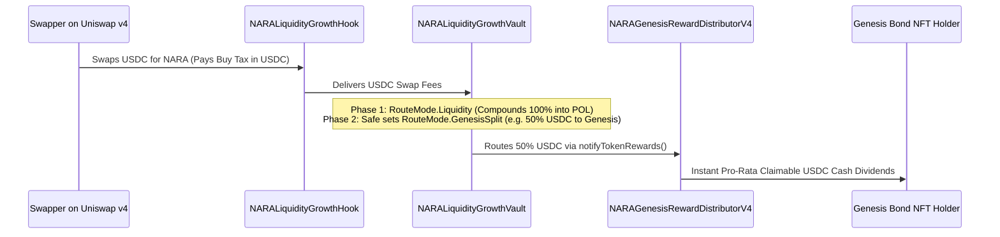

# NARA Protocol — Master Knowledge Base & Deep Architecture Reference

> **Authoritative Knowledge Base for FIELD Token / NARA Protocol Workspace**  
> **Status:** Fixed v4 Production Stack Only (`contracts/v4/`).  
> **Target Network:** Base Mainnet (`chainId: 8453`).  
> **Scope:** Smart Contracts, Economic Formulas, Uniswap v4 Hook/Vault/Compounder, NFT Generative Art Engine, Category Baskets, Swarm Indexer, UI/UX Design Systems, Keepers, Multisig Custody & Governance.

---

## Table of Contents

1. [Executive Summary & Monorepo Topology](#1-executive-summary--monorepo-topology)
2. [Token Supply & Macroeconomics](#2-token-supply--macroeconomics)
3. [NARA Engine & Adaptive Mathematical Models](#3-nara-engine--adaptive-mathematical-models)
4. [Uniswap v4 Dynamic Fee Hook & Fee Vault](#4-uniswap-v4-dynamic-fee-hook--fee-vault)
5. [Liquidity Compounder & POL Flywheel](#5-liquidity-compounder--pol-flywheel)
6. [Position NFTs & Generative On-Chain Art Engine](#6-position-nfts--generative-on-chain-art-engine)
7. [Bond Markets & Genesis Reward Distribution](#7-bond-markets--genesis-reward-distribution)
8. [Composability Layer (stNARA, SY-stNARA, Fractional Positions)](#8-composability-layer-stnara-sy-stnara-fractional-positions)
9. [NARA Category Baskets (Foundry Architecture & Adapters)](#9-nara-category-baskets-foundry-architecture--adapters)
10. [Swarm Monitor & Real-Time Indexer (Ponder)](#10-swarm-monitor--real-time-indexer-ponder)
11. [Frontend Ecosystem & Design Systems](#11-frontend-ecosystem--design-systems)
12. [Operations, Keepers & Multisig Governance](#12-operations-keepers--multisig-governance)
13. [Cross-Repository Release Protocol & State Gates](#13-cross-repository-release-protocol--state-gates)
14. [Codex Solidity Audit Pipeline](#14-codex-solidity-audit-pipeline)
15. [Master Deployment Registry & Verified Addresses](#15-master-deployment-registry--verified-addresses)

---

## 1. Executive Summary & Monorepo Topology

NARA is a **fixed-supply, time-preference yield and protocol-owned liquidity (POL) engine** native to Base. 
The system operates exclusively on the **fixed v4 production stack**. All experimental v5 versions and legacy v3 contracts are retired and frozen.

> 🧭 **Strategic Vision & Roadmap:** For the full phased deployment sequence ($100k Safe Haven floor, on-chain NFTs, public token discovery, and bond tranches), see [`docs/NARA_V4_MASTER_ROADMAP.md`](NARA_V4_MASTER_ROADMAP.md).

### Workspace Architecture
The workspace contains self-contained sub-projects without a shared root `package.json`:

```
c:\Users\linas\Desktop\FIELD Token/
├── nara-protocol-hardhat/             # Canonical v4 Hardhat project: contracts, deploy scripts, tests, runbooks
│   ├── contracts/v4/                  # Sole active Solidity source tree (0.8.34)
│   ├── test/                          # Comprehensive Hardhat TypeScript test suite
│   ├── scripts/                       # Deployment, verification, atomic Safe batch builders
│   ├── deployments/                   # Verified JSON deployment receipts & manifests
│   └── docs/                          # Canonical engineering and operational documentation
├── nara-category-baskets-v1/          # Canonical Category Baskets Foundry project
│   ├── src/                           # Basket Manager, Fee Collectors, Adapters
│   ├── test/                          # Forge test suite (130+ unit & fork tests)
│   └── app/                           # Publishable Baskets web app (React, Vite, Cloudflare Pages/Workers)
├── nara-swarm-monitor/                # Canonical Indexer & Alerting (Ponder, TypeScript)
│   ├── ponder.config.ts               # Multi-contract event source bindings
│   └── ponder.schema.ts               # Relational onchain analytics database schema
├── naraswap/                          # Dedicated NARA v4 Uniswap v4 swap frontend
├── nara_protocol_public/              # Public-facing documentation & verification packages
├── apps/                              # Auxiliary / Historical frontends
│   ├── nara-lockboard/                # Deferred 100-slot light-theme Degen Board
│   ├── nara-arena/                    # Historical v3 Arena game (retired)
│   ├── nara-lotto/                    # Historical v3 Lotto game (retired)
│   ├── nara-analytics/                # Read-only Recharts analytics dashboard
│   ├── nara-protocol-ui/              # naraprotocol.io landing page
│   └── nara-simple-ui/                # Simple lock/mine UI
├── templates/wallet-game-app/         # Pinned wagmi/RainbowKit game starter
├── .codex/audit/                      # 6-Specialist multi-agent smart contract audit pipeline
└── docs/                              # Workspace-wide cross-repo release protocols & UX standards
```

---

## 2. Token Supply & Macroeconomics

### Fixed Supply (`NARAToken.sol`)
- **Total Supply:** `1,000,000 NARA` (`1e24` wei). Minted exactly once to Treasury in the constructor.
- **No Inflation / No Admin Mint:** Zero minting functions, zero burning functions in the token contract.
- **No Backdoors / Pauses:** No owner, no blacklist, no upgrade proxy, no transfer taxes at the ERC-20 token layer.
- **Standard Extensions:**
  - **ERC-2612 Permit:** Gasless approvals via EIP-712 signatures.
  - **ERC-1363 Transfer and Call:** `transferAndCall` & `transferFromAndCall` enabling atomic single-tx token lock actions.
  - **ERC-3156 Flash Mint:** `MAX_FLASH_LOAN = 100,000 NARA` (`10%` of total supply), `FLASH_FEE_BPS = 10` (0.10%). Flash loan fees route to immutable `FLASH_FEE_SINK` (`NARAEngine`).

### Supply Distribution Architecture
1. **Reward Reserve (`NARARewardReserve`):** `650,000 NARA` (65%) sealed in custody. Releases strictly to `NARAEngine` for epoch-by-epoch emissions.
2. **Bond Vault (`NARABondVaultV4`):** `250,000 NARA` (25%) dedicated to discounted vesting bond sales.
3. **Initial Liquidity & Floating Reserve:** `100,000 NARA` (10%) for DEX bootstrapping (60k seeded into Uniswap v4 pool) and initial treasury float.

### Circulating Supply Formula
Circulating supply is computed as:
$$\text{CirculatingSupply} = \text{TotalSupply} - \text{EngineBalance} - \text{RewardReserveBalance} - \text{BondVaultBalance} - \text{ExcludedMarketBalance}$$

---

## 3. NARA Engine & Adaptive Mathematical Models

The `NARAEngine` (`contracts/v4/NARAEngine.sol`) is the heart of the time-preference yield mechanism and the **universal revenue sink of the entire ecosystem**. It manages epochs, locking duration multipliers, emission calculations, stress feedback, and multi-asset reward accounting.

### 3.0 The Universal Value Capture Moat (All Fees Flow to Lockers)
The primary architectural invariant of NARA is that **no revenue sits isolated in sub-contracts**. Every current protocol module and all future ecosystem dApps are engineered to route their cash flow directly into `NARAEngine` to reward active position lockers:

1. **Decentralized Bonds (`NARABondDepositoryV4NFT.sol`):** `50%` of all ETH paid by bond purchasers is immediately pushed into `engine.notifyEthRewards()`.
2. **Category Baskets (`NARAIndexFeeCollectorV2.sol`):** `100%` of basket trading and minting fees are converted via Chainlink oracles into native ETH and pushed into `engine.notifyEthRewards()`, while NARA fees are sent to `engine.depositRewards()`.
3. **Uniswap v4 AMM Fees (`NARALiquidityGrowthVault.sol`):** RouteMode options stream trading fees into POL depth compounding or directly to Genesis Bond lockers (`RouteMode.GenesisSplit`).
4. **Third-Party Bribes (`BribeRouterV4.sol`):** External protocols seeking NARA governance or liquidity alignment route bribe tokens and ETH directly to `NARAEngine`.
5. **Future Ecosystem Applications (Games, Launchpads, Vaults):** Any new product built in the workspace is bound by protocol rules to route protocol revenue into `engine.notifyEthRewards()`.

```
[Bond ETH 50%] ──┐
[Basket Fees]  ──┼──► NARAEngine.notifyEthRewards() ──► 100% Real ETH Cash Dividends to Lockers
[Future dApps] ──┤
[Bribes]       ──┘
```

### 3.1 Epoch Lifecycle & JIT Advance
- **Epoch Duration:** `EPOCH_LENGTH = 900` seconds (15 minutes). 96 epochs per day.
- **Clock Formula:**
  $$\text{currentEpoch} = \left\lfloor \frac{\text{block.timestamp} - \text{GENESIS\_TIMESTAMP}}{\text{EPOCH\_LENGTH}} \right\rfloor$$
- **Just-In-Time (JIT) Auto-Advance:** User-facing calls automatically advance up to `MAX_JIT_ADVANCE = 8` un-settled epochs in-line. If backlog exceeds 8 epochs, operations revert with `EpochStale`, prompting keeper or permissionless `advanceEpochs(maxSteps)` catchup.

### 3.2 Lock Mechanics & Duration Multipliers
Users deposit NARA for $D$ epochs ($\text{minLockEpochs} \le D \le \text{maxLockEpochs}$, where $\text{maxLockEpochs} = 35,040 \approx 1\text{ year}$).
- **Activation:** Locks activate at `currentEpoch + activationDelayEpochs + 1` (default delay: 0 or 1 epoch).
- **Maturity:** Positions unlock after `unlockEpoch = currentEpoch + durationEpochs + 1`.
- **Weight Formula (`NARAEngineModelLib.computeWeight`):**
  $$r = \frac{\text{durationEpochs}}{\text{maxLockEpochs}} \in [0, 1]$$
  $$m = 1 + \frac{\text{durationLinearWad} \times r}{10^{18}} + \frac{\text{durationQuadraticWad} \times r^2}{10^{18}}$$
  $$\text{Weight} = \text{NetAmount} \times m$$
- **Weight Multiplier Ladder (Production Configuration: Linear 0.5, Quadratic 2.5):**
  - Min Duration (1 epoch): $\approx 1.01\times$
  - 90 Days (8,760 epochs): $\approx 1.28\times$
  - 180 Days (17,520 epochs): $\approx 1.88\times$
  - 270 Days (26,280 epochs): $\approx 2.78\times$
  - 365 Days (35,040 epochs): $\approx \mathbf{4.00\times}$ (Max Multiplier cap enforced $\le 10\times$).
- **Concurrent Active Slots & Recycling (`MAX_LOCK_POSITIONS_PER_ACCOUNT = 64`):**
  - Accounts can hold up to 64 active positions concurrently.
  - Slots are **not a lifetime cap**: calling `unlock(positionId)` decrements `_ownerPositionCount`, immediately freeing and recycling the slot for new locks over multi-year compounding cycles.

### 3.3 Adaptive Emission Model Formulas
Executed on every epoch transition (`NARAEngineModelLib.computeNextEpochSnapshot`):

1. **Warmup Factor:**
   $$\text{warmup}_{n+1} = \text{warmup}_n + \frac{\text{warmupRateWad} \times (1 - \text{warmup}_n)}{10^{18}}$$
2. **Bootstrap Weight (Phantom Dilution):**
   $$\text{bootstrap}_{n+1} = \frac{\text{bootstrap}_n \times \text{bootstrapDecayWad}}{10^{18}}$$
3. **Weighted Lock Share (WLS):**
   $$\text{WLS} = \frac{\text{ActiveWeight}}{\text{CirculatingSupply} + \text{ActiveWeight} + \text{BootstrapWeight}}$$
4. **Base Emission Dynamics:**
   $$\text{BaseEmission}_{n+1} = \text{clamp}\left(\frac{\text{BaseEmission}_n \times \text{growthFactorWad}}{10^{18}}, \text{minBaseEmission}, \text{maxBaseEmission}\right)$$
5. **Incentive vs Penalty & Stress Feedback:**
   $$\text{Incentive} = 1 + \frac{a_{\text{wad}} \times \text{WLS}}{10^{18}}$$
   $$\text{Penalty} = \frac{b_{\text{wad}} \times \text{Stress}_n}{10^{18}}$$
   $$\text{EmissionFactor} = \max(\text{Incentive} - \text{Penalty}, 0)$$
   $$\text{Emission} = \text{clamp}\left(\frac{\text{BaseEmission} \times \text{EmissionFactor}}{10^{18}}, 0, \text{maxBaseEmission}\right)$$
6. **Beta & Horizon Contraction:**
   $$\beta = \beta_0 + \frac{m_{\text{wad}} \times \text{Stress}_n}{10^{18}}$$
   $$\text{Horizon} = \frac{e_{\text{max}}}{\beta}$$
7. **Retention & Admitted Supply:**
   $$\text{Retention} = \begin{cases} 0 & \text{if } \text{Circ} \ge \text{Horizon} \\ 1 - \frac{\text{Circ}}{\text{Horizon}} & \text{if } \text{Circ} < \text{Horizon} \end{cases}$$
   $$\text{AdmittedSupply} = \frac{\text{Emission} \times \text{Retention}}{10^{18}}$$
   $$\text{DistributedNara} = \frac{\text{AdmittedSupply} \times \text{dripSplitWad} \times \text{warmup} \times \text{ActiveWeight}}{10^{18} \times 10^{18} \times (\text{ActiveWeight} + \text{BootstrapWeight})}$$
8. **Stress Calculation:**
   $$\text{Stress} = \min\left( \frac{c_{\text{wad}} \times (1 - \text{WLS})}{10^{18}} + \frac{d_{\text{wad}} \times (\text{Emission} / \text{Horizon})}{10^{18}}, 1.0 \right)$$

### 3.4 Multi-Asset Distribution & Ray Indexes
- **Ray Precision:** $10^{27}$ (RAY).
- **Index Updates:** On each epoch or reward notification:
  $$\text{indexRay}_{n+1} = \text{indexRay}_n + \frac{\text{RewardAmount} \times 10^{27}}{\text{ActiveTotalWeight}}$$
- **Claimable Rewards Calculation:**
  $$\text{Earned} = \frac{\text{PositionWeight} \times (\text{indexRay} - \text{positionDebtRay})}{10^{27}}$$
- **Native ETH Distribution:** Injected via `notifyEthRewards()`. 100% of queued ETH distributes in the next epoch.
- **Safety Invariant:** `REWARD_NOTIFIER_ROLE` is permanently renounced from Custody Safe and Vault to prevent arbitrary ERC-20 denominator dilution.

### 3.5 Lock APR Drivers & Yield Scaling Mechanics
The annual percentage rate (APR) earned by locked positions is determined dynamically by the engine's 15-minute emission allocation:

1. **Bootstrap Dilution Phase (Anti-Hyperinflation Guard):**
   - At launch, `bootstrapInitialWeight` ($10\text{M}$) acts as virtual dilution weight.
   - Real locker emission share is scaled by $\frac{\text{ActiveWeight}}{\text{ActiveWeight} + \text{BootstrapWeight}}$.
   - Early APR is intentionally conservative while circulating supply is low and liquidity is bootstrapping.
2. **The 4 Levers to Increase Lock APR:**
   - **Lever 1: Natural Bootstrap Decay (Time Progression):** `bootstrapWeight` decays every epoch by $0.09\%$ (`bootstrapDecayWad = 99.91%`). As it approaches zero, lockers transition from receiving $\approx 0.5\%$ to $100\%$ of the designated locker emission ($0.2646\text{ NARA/epoch}$), providing an organic $\approx 200\times\text{ to }260\times$ multiplier to initial APR.
   - **Lever 2: Compound Base Emission Growth (`growthFactorWad = 1.000104`):** Base emission expands every epoch from $0.20\text{ NARA}$ up to the hard cap of $5.00\text{ NARA/epoch}$ ($175,200\text{ NARA/year}$), expanding the global reward pool by up to $16\times$.
   - **Lever 3: Real-Yield Secondary Fee Distributions:** Any protocol revenue, swap fee sweeps, or treasury revenue routed via `notifyEthRewards()` or `notifyTokenRewards()` distributes $100\%$ directly to active lockers with **zero bootstrap dilution**.
   - **Lever 4: Governance Parameter Configuration (`PARAM_ROLE`):** The Safe multisig can accelerate `bootstrapDecayWad` or increase `minBaseEmission` / `dripSplitWad` subject to `CONFIG_CHANGE_DELAY` timelocks.

---

## 4. Uniswap v4 Dynamic Fee Hook & Fee Vault

NARA's primary liquidity home is an atomic **Uniswap v4 pool** (`NARA/USDC`, 0.30% canonical fee, tick spacing 60).

### 4.1 CREATE2 Permission Encoding (`0x2088`)
Uniswap v4 encodes hook permissions into the lowest bits of the deployed hook address:
- `BEFORE_INITIALIZE_FLAG`: bit 13 (`0x2000`)
- `BEFORE_SWAP_FLAG`: bit 7 (`0x0080`)
- `BEFORE_SWAP_RETURNS_DELTA_FLAG`: bit 3 (`0x0008`)
- **Combined Permission Mask:** `0x2000 | 0x0080 | 0x0008 = 0x2088`. Verified by CREATE2 mining via `Create2HookDeployer.sol`.

### 4.2 Dynamic Fee Curve & Cumulative Pressure Model
- **Exact-Input Only:** Exact-output swaps revert with `ExactOutputUnsupported`.
- **Asymmetric Buy/Sell Curves:**
  - **Buy Curve (USDC in):** Base 3% $\to$ Medium 5% $\to$ High 8% $\to$ Extreme 12% (Default Cap: 12%).
  - **Sell Curve (NARA in):** Base 5% $\to$ Medium 8% $\to$ High 12% $\to$ Extreme 20% (Default Cap: 20%).
- **Block-0 Cumulative Pressure:** Pressure accumulates across all transactions within the same block:
  $$\text{Pressure} = \frac{\text{CumulativeBlockAmountIn}}{\text{protocolDepth}}$$
  Splitting a swap into multiple sub-orders in the same block results in the exact same integrated fee. Pressure resets on subsequent blocks.
- **7-Day Governance Timelock:** Any update to fee curves or `protocolDepth` is subject to `FEE_UPDATE_DELAY = 7 days`. Pending proposals can be cancelled instantly by Safe.

### 4.3 Liquidity Growth Vault (`NARALiquidityGrowthVault.sol`)
- Receives pool fees in input currency (USDC on buys, NARA on sells) directly via `poolManager.take(..., address(vault), feeAmount)`.
- **Dynamic Route Modes (`enum RouteMode`):**
  - **`Liquidity` (0, Active Default):** `100%` of collected USDC & NARA fees compound into permanent Protocol-Owned Liquidity (POL).
  - **`Genesis` (3):** `100%` of incoming pool USDC fees are routed to `NARAGenesisRewardDistributorV4`, paying direct cash dividends to Genesis Bond NFT holders.
  - **`GenesisSplit` (4):** Hybrid mode. Splits USDC fees between Genesis Bond NFT holders (`splitGenesisShareBps`, e.g. 50%) and POL Compounding (remaining 50% USDC + 100% NARA).
  - **`Engine` (1) / `Split` (2):** Disabled/Prohibited to preserve core invariants.
- **The Phased USDC Activation Switch:** The Vault can remain in `RouteMode.Liquidity` during initial bootstrapping, and the Safe multisig can switch to `GenesisSplit` at any later time to stream live AMM trading fees directly to Genesis Bond NFT holders without requiring contract redeployments.
- **Frozen Compounder Binding:** The binding from Vault to Compounder is permanently frozen (`compounderFrozen = true`).

---

## 5. Liquidity Compounder & POL Flywheel

`NARALiquidityCompounderV4.sol` adds permanent protocol-owned liquidity to the Uniswap v4 pool.

### Key Architectural Invariants
1. **Full-Range Liquidity:** Uses `MIN_TICK` to `MAX_TICK` (aligned to tick spacing 60). Never falls out of range, requires zero active rebalancing, minimizes price manipulation surface.
2. **No-Swap Compound:** Never executes market swaps. Only the balanced ratio of NARA:USDC at the live `sqrtPriceX96` is deposited.
3. **Remainder Banking:** Unbalanced surplus (e.g. excess USDC from buy pressure) is banked safely inside the Compounder and rolled into future compound cycles. One-sided fees do not become instant LP.
4. **Position NFT Custody:** The Uniswap v4 LP NFT (`tokenId: 2898486`) is held directly by the Compounder contract (`473,995,658,948,700` liquidity units, ~10.05% of active pool liquidity).
5. **Exact-Spend Invariant:** Pulls exact allowances from Vault, guaranteeing zero stuck funds in intermediate stages.
6. **7-Day Recovery Timelock:** Owner POL-removal operations (`WindDown`, `MigratePosition`, `RecoverPoolTokens`) require `RECOVERY_DELAY = 7 days`.

---

## 6. Position NFTs & Generative On-Chain Art Engine

In NARA v4, every locked position is an ERC-721 token (`NARAPositionNFTV4`, name: `"NARA Position"`, symbol: `NARAPOS`).

### 6.1 Clone Account Architecture (EIP-1167)
```
NARAPositionNFTV4 (ERC-721 Collection)
       │ (owns tokenId N)
       ▼
NARAPositionAccountV4 (EIP-1167 Clone) ← Unique contract per tokenId
       │ (holds positionId N in NARAEngine)
       ▼
NARAEngine Position (global positionId)
```
- **Bearer Asset:** Transferring the NFT transfers ownership of the underlying clone account and its future claimable rewards.
- **Thin Proxy Security:** Clone accounts only accept calls from the NFT factory (`onlyFactory`).
- **Claim Fees:** Configurable wrapper-level fees (up to 10% hard cap) on NARA and bribe tokens. ETH claims bypass wrapper fees. Direct EOA locks bypass NFT wrapper fees entirely.

### 6.2 Generative On-Chain SVG Renderer (`NARAPositionRendererV5.sol`)
Renders 100% on-chain vector art and JSON metadata without external IPFS/HTTP dependencies:
- **Modular Art Architecture:** `NARAArtMetadataV1`, `NARAArtCorePlateV1`, `NARAArtGenesisPlateV1`, `NARAArtSecurityPrintV1`, `NARAPositionArtV1`.
- **Mint-Fixed Deterministic Seeds:** `keccak256(tokenId, positionId, createdEpoch)` generates 6 unique geometric module compositions (Scar angles, Lattice nodes, Glyph fingerprints).
- **Realized Tier Escalation (Tx-Driven, Cache-Safe):**
  - `New` $\to$ `Activated` $\to$ `Rewarded` $\to$ `One ETH Mark` $\to$ `Apex`.
  - Driven strictly by **realized historical delivered rewards** (`lifetimeEthClaimed`, claim count, extension count).
  - Emits ERC-4906 `MetadataUpdate` on claims and lock extensions.
- **Compliance Rule:** The renderer strictly encodes realized historical facts and provenance. It never displays projected returns, estimated APY, or speculative rarity.

### 6.3 Multi-Asset Reward Vault & Multiplier Dynamics (Up to 10.00x)
Each NARA Position NFT functions as a self-contained multi-token cash flow vault:
1. **Multi-Asset Parallel Streams:** The NFT's clone account (`NARAPositionAccountV4`) independently tracks, accumulates, and claims:
   - **NARA Rewards:** From 15-minute epoch emission drips (`claimRewards`).
   - **Native ETH Dividends:** From bond fundraising and category basket conversions (`claimEthRewards` / `claimGenesisEth`).
   - **USDC & Arbitrary ERC-20s:** From parallel distributions and bribe routing (`claimParallelTokenRewards` / `claimGenesisToken`).
2. **Weight Multipliers (Up to 10.00x):**
   - Active default configuration grants up to **`4.00x`** for 365-day commitments.
   - The engine architecture contains a mathematical parameter ceiling of **`10.00x`** (`MAX_MULTIPLIER_WAD = 10e18` in `NARAEngineModelLib.sol`), adjustable via 7-day governance timelock.
   - Genesis Bond NFTs feature custom `rewardMultiplierBps` stamped directly into on-chain metadata for parallel reward distributions.

> ⚖️ **Legal UX & Regulatory Notice:** NARA Position NFTs represent self-directed, non-custodial time-commitment positions within a decentralized protocol. Duration multipliers are structural weighting parameters within the smart contract accounting system and do not constitute promises of investment yield, interest, or financial return. Reward distributions are variable, dependent on protocol activity, and may be zero. NARA tokens, NFTs, and lock positions carry no voting equity or rights against any entity.

---

---

## 7. Bond Markets & Genesis Reward Distribution

### 7.1 Bond Depository (`NARABondDepositoryV4NFT.sol`)
- **Mechanism:** ETH In $\to$ Discounted NARA Locked in Engine $\to$ Genesis Position NFT delivered to buyer.
- **Fixed-Price Model:** Admin-set fixed price with 24-hour change delay (`MIN_PRICE_DELAY = 1 day`) and 48-hour expiration (`MAX_TERMS_AGE = 2 days`).
- **Safety Caps:** Max discount hard-capped at 30% (`MAX_DISCOUNT_BPS = 3,000`).
- **ETH Routing Split (`rewardSplitWad`):** Fully configurable from `0%` to `100%` (`MAX_REWARD_SPLIT_WAD = 1e18`). Default is `0.50` (50% to `NARAEngine.notifyEthRewards()`, 50% to Treasury). Can be configured to 100% Treasury / 0% Lockers or 100% Lockers / 0% Treasury depending on capital requirements.
- **Inventory Sourcing:** Pulls NARA on-demand from `NARABondVaultV4` (250,000 NARA reserve).

### 7.2 Genesis Reward Distributor (`NARAGenesisRewardDistributorV4.sol`)
- Parallel reward pool exclusively for Genesis NFT holders.
- **Reward Multiplier:** Up to $5.0\times$ (`MAX_GENESIS_REWARD_MULTIPLIER_BPS = 50,000`).
- **Genesis Reward Weight:** $\text{Weight} = \text{Amount} \times \text{Multiplier}$.
- **Eternal Genesis Positions:** Cannot unlock principal via normal methods. Exit is strictly through `burnEternalGenesis(tokenId)` after maturity, which forfeits Genesis reward weight and returns principal.

### 7.3 Capital Formation, Cash Flow Rounds & Valuation Strategy
Bonds operate as decentralized on-chain capital formation rounds (equivalent to Series A/B funding), exchanging discounted future tokens for real ETH cash flow without market dumping:

```
[Bond Buyer Deposits ETH] ──► [50% ETH] ──► NARAEngine.notifyEthRewards() (Direct Cash Dividends to Lockers)
                         └──► [50% ETH] ──► Protocol Treasury (Permanent POL & Liquidity Backing)
```

1. **Strategic Pilot Batch #1 (`20,000 NARA` at $\ge \$1.00\text{ USD}$ Target):**
   * **Valuation Gate:** Bonds open only when $NARA spot is $\ge \$1.00$ to conserve the 250k reserve against early micro-cap dilution.
   * **Batch Capacity:** `20,000 NARA` (only 2.0% of total supply / 8% of bond reserve).
   * **Gross Value Raised:** `~$16,000 – $17,000 USD` in real ETH (at 15–20% discount).
   * **Immediate Impact:** `~$8,000+ USD in ETH` paid directly to active lockers as instant dividends; `~$8,000+ USD in ETH` added to Treasury. `0 NARA` dumped on AMM (100% time-locked 1 year at `4.00x`).
2. **Macro Scale Economics (`250,000 NARA` Reserve at Scale):**
   * At **`$100.00 / NARA`**: Gross reserve value = **`$25,000,000 USD`**.
   * At 20% discount ($80/token): Raises **`$20,000,000 USD in ETH`**.
   * **`$10,000,000 in ETH`** paid directly to protocol lockers + **`$10,000,000 in ETH`** to Treasury backing.
   * All 250,000 tokens locked 1 year inside the Engine, preventing market dumps while capturing massive protocol solvency.

### 7.4 The Phased AMM USDC Fee-Sharing Switch (Bond NFT Superpower)
Genesis Bond NFTs possess the capability to capture direct cash flow from **all Uniswap v4 trading volume**:



* **Decoupled Activation:** Bonds can be sold while the Vault operates in `RouteMode.Liquidity`. Genesis metadata and `Genesis Reward Weight` are stamped permanently on the NFTs at mint time.
* **Activating at Scale:** When trading volume reaches maturity, the Safe Multisig executes `vault.setRouteMode(RouteMode.GenesisSplit)`, activating continuous USDC distributions to all Genesis Bond holders without changing contract bytecode or disrupting active locks.

---

## 8. Composability Layer (stNARA, SY-stNARA, Fractional Positions)

Located in `contracts/v4/composability/`:

### 8.1 Liquid Staking (`NARAStakingPoolV4.sol` / `stNARA`)
- ERC-4626 style liquid staking pool.
- Aggregates user NARA deposits and automatically creates maximum-duration (35,040 epochs $\approx 3\times$ weight) engine positions.
- **Queued Redemptions:** `queueRedeem(shares)` provides orderly exits as underlying positions mature or liquidity becomes available.
- **Reward Auto-Harvesting:** Collects NARA, ETH, and USDC rewards and distributes to `stNARA` holders via internal reward indexes.

### 8.2 Pendle Standardized Yield (`NARAStakingPoolSYV4.sol` / `SY-stNARA`)
- Implements the Pendle Standardized Yield (SY) interface for `stNARA`.
- Enables tokenizing NARA yield into Principal Tokens (PT) and Yield Tokens (YT) on Pendle.

### 8.3 Fractional Positions (`NARAFractionalPositionFactoryV4.sol` & `NARAFractionalPositionV4.sol`)
- Allows locking a single `NARAPositionNFTV4` into a smart vault and issuing 1,000,000 fractional ERC-20 tokens.
- Fractions trade freely on DEXes, claim pro-rata NARA/ETH rewards, and redeem underlying principal upon position maturity.

---

## 9. NARA Category Baskets (Foundry Architecture & Adapters)

Located in `nara-category-baskets-v1/` (Foundry build system).

### 9.1 Immutable Basket Position Manager (`NARAImmutableBasketPositionManagerV1.sol`)
- ERC-721 tokenized basket positions.
- Users deposit USDC/WETH and buy defined portfolio baskets in a single atomic transaction.
- **Required Asset Anchor:** **$NARA is mandatory in every basket** with a protocol-enforced minimum weight.
- **Four Canonical Categories:**
  1. **CORE:** Foundation assets ($NARA, WETH, cbBTC).
  2. **AI:** Artificial intelligence category tokens.
  3. **FINANCE:** Decentralized finance tokens.
  4. **CULTURE:** Community and cultural ecosystem tokens.
- **Streaming Holding Fees:** Linear time-based holding fees collected on position interaction (`holdingFeeBps \le 200` BPS/yr).
- **Referral Rewards:** Configurable referral fee share (`referralShareBps \le 5,000` BPS = 50% of protocol fees).
- **Non-Custodial Underlying Exits:** Users can exit via `sell` (swap back to payment token) or `withdrawUnderlying` (receive raw portfolio tokens directly).

### 9.2 DEX Swap Adapters (`src/adapters/`)
Modular swap adapters implementing `INARABasketSwapAdapterV1`:
- `UniswapV4BasketAdapterV1.sol`: Routes swaps through the canonical NARA Uniswap v4 hook pool via Universal Router.
- `UniswapV3BasketAdapterV1.sol`: Uniswap v3 single-hop / multi-hop adapter.
- `AerodromeBasketAdapterV1.sol`: Aerodrome v2 AMM pools on Base.
- `AerodromeSlipstreamBasketAdapterV1.sol`: Aerodrome Slipstream concentrated liquidity CL pools.
- `PancakeV3BasketAdapterV1.sol`: PancakeSwap v3 CL pools.

---

## 10. Swarm Monitor & Real-Time Indexer (Ponder)

Located in `nara-swarm-monitor/`. Powered by Ponder framework for real-time Base event indexing.

### Relational Schema Tables (`ponder.schema.ts`)
- **`wallets`:** Address tracking, conviction scores, risk levels, first seen blocks.
- **`transactions` & `erc20_transfers`:** Full execution traces, gas profiling, transfer logs.
- **`locks` & `claims`:** Position lifecycle, activation tracking, historical NARA/ETH/token reward distributions.
- **`nfts` & `nft_transfers`:** Token ownership, Genesis metadata, realized tier tracking.
- **`liquidity_events`:** Uniswap v4 mint/burn/modify liquidity events.
- **`hook_fee_events` & `hook_flow_blocks`:** Detailed per-block pressure analysis, marginal vs effective fees, cumulative flow tracking.
- **`compounder_events` & `compounder_banks`:** Realized POL additions, banked surplus tracking.
- **`engine_epoch_snapshots`:** On-chain epoch state, WLS, stress index, beta, horizon, base emission.
- **`basket_positions` & `basket_swaps`:** Basket purchases, adapter routing, holding fee accrual, redemptions.
- **`alerts` & `protocol_health`:** Automated triggers for epoch delays, whale movements, abnormal slippage, and contract state divergence.

---

## 11. Frontend Ecosystem & Design Systems

### 11.1 Publishable Basket App (`nara-category-baskets-v1/app/`)
- **Stack:** React 19, Vite, Tailwind CSS, Cloudflare Pages & Workers.
- **Visual Design Rules (`DESIGN.md`):**
  - **Fonts:** `Satoshi` (headings) / `Inter` (UI body) / `IBM Plex Mono` (numbers & hashes only).
  - **Accent Color:** `#0000FF` Base Blue (Never `#1877f2` or generic purple).
  - **Token Tickers:** Canonical `$NARA` branding.
  - **Token Rails:** Text rails (`$NARA · WETH · cbBTC`), no rainbow dot legends.
  - **Neutral Badges:** Clean monochrome badges, no blue/purple/gold gamified tiers.

### 11.2 Neutral Action Hierarchy (`docs/UI_UX_NEUTRAL_ACTION_HIERARCHY.md`)
**Mandatory Rule for all Web3/Financial UIs:**
> **"Do not decide the asset for the user. Decide the navigation for the user."**

- **Guided Flow:** Connect Wallet $\to$ View Products $\to$ Preview Selected $\to$ Review Terms/Fees/Risks $\to$ Confirm Self-Directed Transaction.
- **Equal Visual Weight:** Comparable cards must have identical layout and visual weight.
- **Banned Promotional Clichés:** Prohibited terms include `Recommended`, `Best`, `Safest`, `Trending`, `Guaranteed APY`, `Low Risk`, `You should buy this`.
- **Pre-Transaction Review:** Must explicitly display asset list, weights, protocol fees, slippage estimates, execution route, exit paths, and risk notices.

### 11.3 Degen Board System (`apps/nara-lockboard/`)
- **Parchment Light Theme:** `--bg: #f7f2e8`, `--text: #191612`, `--accent: #1877f2`.
- **Typography:** `JetBrains Mono` everywhere.
- **Prefix:** `nb-` class naming convention (`nb-shell`, `nb-slot`, `nb-board-wrap`).
- **Epoch Backlog Guard:** Apps must inspect `currentEpoch` vs `epochState.epoch`. If backlog $> 0$, disable mutating actions and show an explicit **Sync Epoch** button.

---

## 12. Operations, Keepers & Multisig Governance

### 12.1 Production Custody Safe
- **Production Admin Safe Address:** `0xd65c0e390Dc187A22c52c03816591CC736C0D755` (Base Mainnet).
- **Treasury Address:** `0xfe3A8678A9c729438BB11718bD1391E7Ab491E8e`.
- Holds ownership of `NARALiquidityGrowthHook`, `NARALiquidityGrowthVault`, `NARALiquidityCompounderV4`, `Create2HookDeployer`, and seed LP NFT `2898124`.

### 12.2 GitHub Operational Keepers
- **`v4-epoch-maintainer.yml` (ACTIVE):**
  - Schedule: `7,37 * * * *` (Twice hourly).
  - Dedicated Gas-Only Key: `0xE3DDa33EdB0f8b6aa39e4ce853Ba7C4A29e520DD`.
  - Operations: Calls `advanceEpoch()` / `advanceEpochs()`, verifies runtime bytecode hashes, pings external heartbeat monitor.
- **`v4-liquidity-maintainer.yml` (DISABLED):**
  - Manually disabled. Compounder operations require dedicated human authorization and validation.

---

## 13. Cross-Repository Release Protocol & State Gates

Defined in `docs/NARA_CROSS_REPOSITORY_RELEASE_PROTOCOL.md`.

### Single Source of Truth Authority Matrix
| Repository | Authority Domain |
|---|---|
| `nara-protocol-hardhat/` | Fixed-v4 contracts, ABIs, deploy scripts, protocol manifests. Origin for all core changes. |
| `nara-category-baskets-v1/` | Basket contracts, adapters, basket manifests, publishable basket app. |
| `nara-swarm-monitor/` | Indexer schemas, event handlers, monitoring alerts, read-only analytics. |
| `nara_protocol_public/` | Public documentation, beginner guides, verified deployment packages. |

### Strict State Gate Sequence
$$\text{implemented} \longrightarrow \text{tested} \longrightarrow \text{merged} \longrightarrow \text{deployed} \longrightarrow \text{configured} \longrightarrow \text{indexed} \longrightarrow \text{activated} \longrightarrow \text{available}$$
- Never use the generic word `"live"` in release records.
- Never update downstream consumers from uncommitted branches, local edits, or planned addresses.

---

## 14. Codex Solidity Audit Pipeline

Located in `.codex/audit/`. Workspace serves as a dedicated security audit hub.

### Pipeline Stages
1. **`01-recon.md`:** Codebase topology, compilers, libraries, attack surface scan.
2. **`02-threat-model.md`:** Trust boundaries, actor privileges, economic flow diagrams.
3. **Specialist Waves (Cap: 6 parallel specialists):**
   - **Wave 1:** Reentrancy, Access Control, Arithmetic/Accounting, External Integrations, MEV/Economic, DoS/Griefing.
   - **Wave 2:** Upgradeability, Signatures/Replay, Protocol-Specific Logic.
4. **`12-confirmed.json` (Critic):** Deduplicates, tests validity, rejects false positives.
5. **`13-pocs/` (PoC Writer):** Generates executable Foundry proof-of-concept tests.
6. **`14-final-report.md` (Reporter):** Executive summary, categorized vulnerability register with `file:line` citations and remediations.

---

## 15. Master Deployment Registry & Verified Addresses

*Network: Base Mainnet (`chainId: 8453`)*

| Contract / Component | Verified Address | Status | Notes |
|---|---|---|---|
| **`NARALauncher`** | `0xb8CF0274d0Fb2dB2Ba5dC58b0Ab378F3b8f35BA2` | Verified | Deploys paired Token + Engine |
| **`NARAToken`** | `0xB6333F5D4cEd8dffA80F3F13697D6aA3BB3f19c1` | Verified | Symbol: `NARA`, 1M Fixed Supply |
| **`NARAEngine`** | `0x98ab6406D6B548F37dEF7110961bb45A399e5aFC` | Verified | Core Epoch Allocation Engine |
| **`NARARewardReserve`** | `0x8369CEf28128A4B24Bc5ed52aA6196D92D563F2f` | Verified | Funded with `650,000 NARA` |
| **`NARALiquidityGrowthVault`** | `0xD7f7b44BF65EBa3E90fDe0642687ed22A323084D` | Verified | Safe-owned; Compounder frozen |
| **`Create2HookDeployer`** | `0xDE9E3Cac08b7a31Db18c7432d4C45DF4584Fd646` | Verified | Safe-owned CREATE2 factory |
| **`NARALiquidityGrowthHook`** | `0x59AEf9799DEA01A7FB7dA73BEA10dfB08858A088` | Verified | Uniswap v4 Hook (bits `0x2088`) |
| **`NARALiquidityCompounderV4`** | `0xfeFcc45C0454D022586eaA8a5c51BD25DCe713DF` | Verified | Owns POL LP NFT `2898486` |
| **Uniswap v4 Pool ID** | `0x83edced1f39e6adf7469cd718eeb409824d948959263408d4cfb6e745c8db464` | Initialized | NARA/USDC 0.30% fee, tick 60 |
| **Seed LP NFT** | `2898124` | Active | Owned by Production Safe |
| **Compounder LP NFT** | `2898486` | Active | Owned by Compounder |
| **Production Safe** | `0xd65c0e390Dc187A22c52c03816591CC736C0D755` | Active | Multi-sig Admin |
| **Treasury Wallet** | `0xfe3A8678A9c729438BB11718bD1391E7Ab491E8e` | Active | Protocol Treasury |
| **Epoch Keeper Address** | `0xE3DDa33EdB0f8b6aa39e4ce853Ba7C4A29e520DD` | Active | Gas-only maintainer key |
