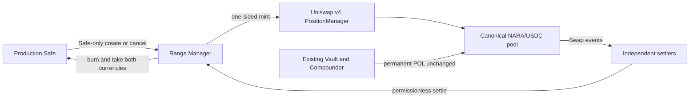

# NARA Treasury Range Manager V1 Architecture

Status: implementation candidate; not deployed, activated, or approved for production execution.

Change ID: `NARA-20260828-v4-treasury-range-manager`

## Purpose

`NARATreasuryRangeManagerV1` is a narrowly scoped Uniswap v4 periphery contract for Safe-authorized, one-sided treasury ranges in the canonical NARA/USDC pool. It is separate from permanent protocol-owned liquidity. A range that reaches its terminal boundary may be burned permissionlessly, with both currencies transferred directly to the immutable production Safe. V1 never automatically redeploys settlement proceeds.

This design offers transparent liquidity at pre-authorized prices. It does not manufacture volume, restrict transfers, select counterparties, or guarantee a market outcome.

## System boundaries



The three operational domains remain independent:

1. Existing permanent POL continues through the seed position, Vault, and Compounder without modification.
2. The Range Manager owns only registered tactical order positions for operational purposes.
3. Off-chain settlers have gas only. They cannot create, cancel, edit, register, or redirect an order.

## Immutable deployment bindings

The non-upgradeable contract is permanently bound to:

- the production Safe and direct settlement recipient;
- NARA and USDC, with `currency0 = USDC` and `currency1 = NARA`;
- PoolManager, PositionManager, and Permit2;
- the existing NARA liquidity Hook and Vault;
- the canonical PoolKey, PoolId, fee, and tick spacing.

Construction fails unless deployed runtime and reciprocal bindings match the supplied canonical configuration. Hook liquidity callbacks must remain disabled. The constructor does not make a production-state claim on its own: an immutable, receipt-pinned deployment manifest and runtime verification remain mandatory after any future deployment.

## Circle USDC dependency boundary

Base USDC is treated as an administratively upgradeable external dependency, not as a fixed implementation merely because its proxy address and proxy runtime remain unchanged. Strategy schema v2 records Circle's Zeppelinos proxy mechanism, exact implementation/admin storage slots, proxy and implementation address/runtime hashes, proxy admin, token owner, pauser, blacklister, paused state, and blacklist state for the Safe, PoolManager, PositionManager, Permit2, Vault, Compounder, and Range Manager when known. The Base Multicall3 reader address/runtime hash used to batch caller-independent token views is also pinned.

State generation records that evidence at the pinned block. Deployment and order builders re-read it at the JIT packet block, add the predicted or deployed manager to the exact actor set, and require full equality before serialization. The settler performs the same observation independently through all three providers and rejects disagreement, drift, pause, or any monitored blacklist state before nonce selection, signing, or exact rebroadcast. Proxy bytecode equality alone is never accepted as implementation identity.

This is detection and fail-closed containment, not control over Circle. A privileged incompatible USDC upgrade after a snapshot but before transaction inclusion can still make token movement fail. Tactical exposure must remain bounded. Emergency Safe cancellation deliberately bypasses the JIT USDC equality/health gate so exit construction remains available after drift; its human review labels the attached evidence as the old strategy snapshot. The bypass is cancellation-only and cannot make an incompatible token transfer succeed.

## Authority

| Operation | Authorized caller | Recipient |
| --- | --- | --- |
| Create sell or buy order | Immutable Safe | Manager mints registered NFT |
| Cancel active order | Immutable Safe | Immutable Safe |
| Pause or unpause creation | Immutable Safe | Not applicable |
| Settle terminal order | Anyone | Immutable Safe |
| Quarantine unregistered PositionManager NFT | Immutable Safe | Immutable Safe |

There is no generic call executor, configurable recipient, upgrade authority, settlement allowlist, keeper reward, or general recovery function.

## Order lifecycle

An order moves monotonically:

```text
None -> Active -> Settled
               -> Cancelled
```

Creation is blocked while paused. Settlement and cancellation remain available. A terminal state cannot become active again.

Creation accepts a Safe-reviewed `strategyHash` and deadline. It validates aligned ticks, strict one-sided composition, nonzero input and output minimum, deterministic full-conversion principal, and bounded integer widths. It pulls only the approved maximum input, grants call-scoped ERC-20 and Permit2 allowances, mints the expected next PositionManager token ID, clears both allowance layers, and returns deterministic dust to the Safe.

Cancellation accepts independent NARA and USDC output floors plus a deadline. This prevents a stale cancellation packet from silently accepting a materially changed inventory composition.

## Currency and tick orientation

The PoolKey is ordered as USDC/NARA in raw token units:

```text
currency0 = USDC with 6 decimals
currency1 = NARA with 18 decimals
```

Uniswap tick tracks raw `currency1 / currency0`. Consequently, a higher human USDC-per-NARA price moves tick and `sqrtPriceX96` down.

- `SELL_NARA` starts entirely in currency1 with current sqrt price at or above the upper boundary. It is terminal when `sqrtPriceX96 <= sqrtPriceAtTick(tickLower)`.
- `BUY_NARA` starts entirely in currency0 with current sqrt price at or below the lower boundary. It is terminal when `sqrtPriceX96 >= sqrtPriceAtTick(tickUpper)`.

The contract compares exact sqrt boundaries. Off-chain planning uses bigint/rational conversions and reports realized prices after tick-spacing alignment.

## Settlement

Settlement validates Active state, registered token ownership, nonzero position liquidity, and the side-specific terminal sqrt boundary. It marks the order terminal before calling PositionManager; a revert restores the entire transaction.

The PositionManager call uses `BURN_POSITION + TAKE_PAIR`. The immutable Safe is encoded as recipient. The stored minimum applies to the expected output currency, while the contract measures both Safe balance deltas and verifies the position has no remaining liquidity. Principal, accrued LP fees, and rounding balances all go to the Safe.

`settleMany` is bounded and never loops over historical orders. Settlers paginate registered active IDs, prefilter through `isSettleable`, and simulate the exact batch before submission.

## PositionManager NFT injection

Uniswap PositionManager mints with `_mint`, not `_safeMint`, and ordinary ERC-721 `transferFrom` does not call `onERC721Received`. No recipient contract can prevent an attacker from assigning it an unrelated PositionManager NFT.

V1 therefore enforces the achievable invariant:

> An unregistered PositionManager NFT can never become an order or be settled, cancelled, or treated as managed treasury principal.

Only the exact token ID observed during the manager's synchronous mint can be registered. Unsolicited safe transfers are rejected. A Safe-only quarantine function may transfer an unregistered PositionManager NFT only to the immutable Safe; it can never operate on a registered order token.

Operational enumeration uses the order registry, never `PositionManager.balanceOf(manager)`. A balance mismatch is an alert, not a reason to stop valid settlements.

## Allowance and balance discipline

The manager must finish every successful create, settle, cancel, or quarantine path with:

- no ERC-20 allowance to Permit2;
- no Permit2 allowance to PositionManager;
- no unnecessary NARA or USDC balance;
- no arbitrary recipient approval.

`assertOperationalClean()` exposes the approval and residual-balance checks used as the final call in unsigned Safe creation batches. Unexpected unsolicited token transfers may make a zero-balance assertion fail; they cannot authorize an order or redirect managed assets. Operators must reconcile and handle that condition through the immutable Safe policy rather than weaken settlement.

## Why burning prevents later reversal

An ordinary concentrated position remains live after full traversal. If price retraces before removal, it can convert back. Burning removes its liquidity and sends the converted inventory to the Safe; a later transaction cannot reuse that inventory through the burned position.

This protection begins only after the settlement transaction confirms. An external settler cannot interpose within another actor's atomic buy-and-reverse transaction, and a crossed but unburned range may re-enter before settlement. V1 documents and monitors this latency; it does not claim atomic protection.

Hook-integrated atomic settlement could be researched separately for V2. It is excluded because it would alter the active production Hook, increase callback complexity, and require a separate protocol-critical review and deployment.

## Off-chain service

Two independent instances may observe PoolManager Swap events. Each uses its own gas-only account and RPC set, performs a periodic full order sweep, simulates exact calldata through all three providers, serializes its own nonce use, and reconciles receipt-block state through all three providers. Every critical request has a source-labelled deadline and every sweep has a watchdog; a hang exits for supervised restart without weakening three-of-three consensus.

Signed raw transaction, hash, nonce, and order intent are durably persisted before broadcast. A dropped view or terminal order race never frees that nonce for another intent; only a canonical confirmed receipt for the exact hash clears the lineage. Crash recovery can rebroadcast only the identical raw transaction after fresh three-provider canonical bindings, USDC dependency validation, and exact-calldata simulation. A proven competing settlement is a successful race loss. Neither instance has Safe or manager administration authority.

## Release and production boundary

The repository may contain implementation, fork simulations, optimizer output, and unsigned Safe Transaction Builder artifacts. None of those is deployment authority. Production use would separately require:

1. reviewed and merged immutable source commit;
2. recorded senior analysis, independent adversarial review, strongest-model architecture review, automated security gates, and human acceptance; no independent external audit is implied;
3. exact canary strategy and human-reviewed output minimums;
4. unsigned deployment packet review and Safe approval;
5. receipt-pinned deployment/runtime manifest;
6. fresh order packet built from current state and Safe nonce;
7. two independently operated settlers and monitoring;
8. at least 48 hours of canary evidence before considering expansion.

No source artifact or candidate manifest authorizes signing or broadcast.
